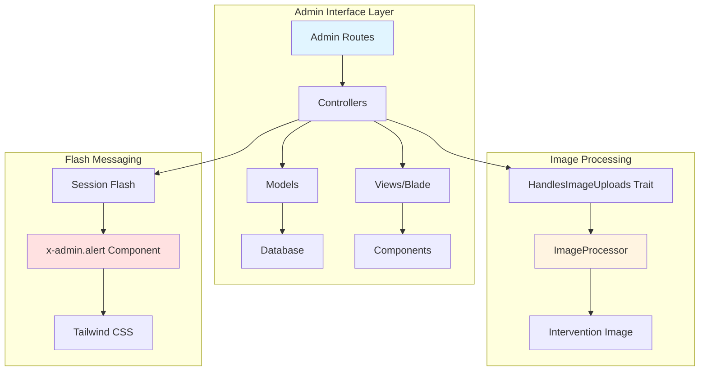

# Design Document: Admin Interface Comprehensive Refactor

## Overview

This refactor addresses four critical areas of the admin interface for a Laravel application: graduates database schema and image handling, training section UI redesign, flash message visibility improvements, and routing integrity validation. The goal is to create a consistent, accessible, and fully functional admin interface while maintaining existing functionality and improving user experience.

The refactor focuses on practical improvements that enhance maintainability and user experience without introducing breaking changes to the existing architecture.

## Architecture



## Components and Interfaces

### 1. Database Migration: Graduates Table

**Purpose**: Add missing `image` column to support per-graduate image storage

**Schema Update**:
```php
// New migration file
Schema::table('graduates', function (Blueprint $table) {
    $table->string('image', 255)->nullable()->after('description');
});
```

**Responsibilities**:
- Add `image` column (VARCHAR 255, nullable)
- Position after `description` column
- Support existing records (nullable constraint)

### 2. GraduatesController Modifications

**Purpose**: Remove hero section dependency, focus on per-graduate image handling

**Interface**:
```php
class GraduatesController extends Controller
{
    public function index(): View;
    public function create(): View;
    public function store(Request $request): RedirectResponse;
    public function edit(Graduate $graduate): View;
    public function update(Request $request, Graduate $graduate): RedirectResponse;
    public function destroy(Graduate $graduate): RedirectResponse;
    // Remove: updateHero() method
}
```

**Responsibilities**:
- Remove `updateHero()` method and related logic
- Remove hero section form from index view
- Simplify index view to focus on graduate cards only
- Maintain existing image upload functionality via ImageProcessor
- Ensure proper image deletion on graduate removal

### 3. Training Section UI Redesign

**Purpose**: Transform from horizontal 4-image layout to responsive card-based layout

**Current Structure**:
- 4 images displayed horizontally
- Title and description separate from images

**New Card-Based Structure**:
```php
// Each training card displays:
// - One featured image at top (from image1-4, first available)
// - Title underneath image
// - Description underneath title
// - Responsive grid layout (1 col mobile, 2 col tablet, 3-4 col desktop)
```

**View Component Structure**:
```blade
<div class="grid grid-cols-1 md:grid-cols-2 lg:grid-cols-3 xl:grid-cols-4 gap-6">
    @foreach($trainings as $training)
        <div class="card">
            <div class="gallery-img-wrapper">
                image1 ?? $training->image2 ?? $training->image3 ?? $training->image4) }}" />
            </div>
            <h3>{{ $training->title }}</h3>
            <p>{{ $training->description }}</p>
        </div>
    @endforeach
</div>
```

**Responsibilities**:
- Maintain existing 4-image storage in database (no schema changes)
- Use first available image (image1, then image2, etc.) as card featured image
- Implement responsive grid layout
- Reuse existing `gallery-img-wrapper` component styling
- Maintain all existing TrainingsController functionality

### 4. Flash Message Component Refactor

**Purpose**: Fix invisible flash messages by implementing high-contrast styling

**Current Issue**:
```php
// Current styling (low contrast)
'success' => 'bg-green-50 border-green-200 text-green-800',  // Light on light
'error' => 'bg-red-50 border-red-200 text-red-800',          // Light on light
```

**New High-Contrast Styling**:
```php
// Proposed styling (high contrast)
'success' => 'bg-green-600 border-green-700 text-white',
'error' => 'bg-red-600 border-red-700 text-white',
'warning' => 'bg-yellow-500 border-yellow-600 text-white',
'info' => 'bg-blue-600 border-blue-700 text-white',
```

**Component Interface**:
```blade
@props(['type' => 'success'])

<div class="{{ $alertClasses[$type] }} rounded-lg border-2 p-4 mb-6 flex items-center shadow-md">
    <i class="fas {{ $icons[$type] }} mr-3 text-lg"></i>
    <div class="flex-1 font-medium">{{ $slot }}</div>
    <button type="button" class="ml-4 hover:opacity-75" onclick="this.parentElement.remove()">
        <i class="fas fa-times"></i>
    </button>
</div>
```

**Responsibilities**:
- Update color schemes for all alert types
- Ensure WCAG AA contrast compliance (4.5:1 minimum)
- Maintain existing icon and close button functionality
- Apply consistently across all admin pages

### 5. Routing Integrity Validation

**Purpose**: Ensure all routes point to existing controller methods and views

**Validation Strategy**:
```php
// Route validation checklist:
// 1. All route definitions reference existing controller methods
// 2. All controller methods return existing view files
// 3. All form actions point to valid named routes
// 4. All href links use valid route names
```

**Areas to Validate**:
- Graduates routes after `updateHero` removal
- Training routes (ensure all CRUD operations intact)
- Admin layout navigation links
- Flash message usage across all controllers

**Responsibilities**:
- Document all route changes (specifically graduates.update-hero removal)
- Verify all remaining routes are functional
- Update any broken view file references
- Ensure form action attributes use correct route names

## Data Models

### Graduate Model

**Current Structure**:
```php
protected $fillable = [
    'title',
    'description',
    'image',        // ← Already in fillable, but column missing in DB
    'is_active',
    'order',
];
```

**No changes required** - Model already has `image` in fillable array

### Training Model

**Current Structure** (no changes):
```php
protected $fillable = [
    'title',
    'description',
    'image1',
    'image2',
    'image3',
    'image4',
    // ... other fields
];

public function getAllImages(): array
{
    return array_filter([
        $this->image1,
        $this->image2,
        $this->image3,
        $this->image4,
    ]);
}
```

**Responsibilities**:
- Maintain existing 4-image storage
- Helper method `getAllImages()` remains available
- No schema changes required

## Error Handling

### Image Upload Errors

**Condition**: Image file exceeds size limit or invalid format
**Response**: Validation error with specific message
**Recovery**: Display validation error via flash message, maintain form input

### Database Migration Errors

**Condition**: Migration fails (column already exists, constraint violation)
**Response**: Rollback transaction, log error details
**Recovery**: Check for existing column before adding, make migration idempotent

### Missing Image File Errors

**Condition**: Database references image path that doesn't exist on disk
**Response**: Display placeholder image or default icon
**Recovery**: Gracefully handle missing files in views with null coalescing

### Route Not Found Errors

**Condition**: View references non-existent route after refactor
**Response**: 404 or routing exception
**Recovery**: Systematic validation of all route references before deployment

## Testing Strategy

### Unit Testing Approach

**Controllers**:
- Test GraduatesController without hero methods
- Test TrainingsController maintains existing functionality
- Verify image upload handling via ImageProcessor
- Test flash message generation

**Models**:
- Verify Graduate model saves with image attribute
- Test Training model `getAllImages()` helper

**Components**:
- Test x-admin.alert renders with new color schemes
- Verify alert visibility across different backgrounds

**Key Test Cases**:
1. Graduate creation with image upload
2. Graduate update with image replacement
3. Graduate deletion with image cleanup
4. Training display with multiple images
5. Training display with single image
6. Training display with no images
7. Flash message rendering (all types)
8. Flash message contrast ratios

### Integration Testing Approach

**End-to-End Flows**:
1. Admin creates graduate with image → verify DB + file storage
2. Admin edits graduate image → verify old image deleted
3. Admin deletes graduate → verify image cleanup
4. Admin views trainings list → verify card layout renders correctly
5. Flash message appears after CRUD operations → verify visibility

**View Rendering**:
- Graduates index page without hero section
- Trainings index page with new card layout
- Alert components across all admin pages

**Route Testing**:
- All graduates routes return 200
- Removed graduates.update-hero returns 404
- All training routes functional
- Form submissions work correctly

## Performance Considerations

### Image Processing

- Maintain existing ImageProcessor optimization (JPEG conversion, quality 80)
- Single image per graduate (lighter than hero + multiple images)
- Training cards show one image per card (lighter than 4 images per row)

### Database Queries

- No N+1 query issues (existing eager loading preserved)
- Graduate ordering maintained (`orderBy('order')`)
- Training latest ordering maintained (`latest()`)

### Frontend Rendering

- Responsive grid layout uses native CSS Grid (no JS overhead)
- Card-based layout improves mobile performance
- Lazy loading can be added for image-heavy pages (future enhancement)

## Security Considerations

### Image Upload Security

- Maintain existing validation (file type, size limits)
- ImageProcessor enforces JPEG conversion (prevents malicious file types)
- File storage outside public web root (existing approach)
- Filename randomization prevents path traversal (existing approach)

### Authentication & Authorization

- All routes remain behind 'auth', 'verified', 'admin' middleware
- No changes to authorization logic
- Maintain existing CSRF protection on forms

### Input Validation

- Existing validation rules preserved
- Image upload validation maintained
- String length limits enforced (title: 255, etc.)

## Dependencies

**Existing Dependencies** (no new additions):
- Laravel Framework (current version)
- Intervention Image v4 (image processing)
- Tailwind CSS (styling)
- Font Awesome (icons)
- Blade templating engine

**Components Used**:
- `x-admin.alert` (modified)
- `x-admin.card` (existing)
- `x-admin.page-header` (existing)
- `x-admin.badge` (existing)
- `x-admin.button` (existing)
- `x-admin.empty-state` (existing)

**Services Used**:
- `ImageProcessor` (existing)
- `SiteSetting` (no longer used for graduates hero, but preserved for other sections)

## Migration Strategy

### Phase 1: Database Schema
1. Create migration to add `image` column to graduates table
2. Run migration in development
3. Verify existing records unaffected (nullable column)

### Phase 2: Graduates Section
1. Remove hero section from view
2. Remove `updateHero()` method from controller
3. Remove hero route from routes file
4. Test graduate CRUD operations
5. Verify image handling works correctly

### Phase 3: Training UI
1. Update trainings index view with new card layout
2. Test responsive behavior
3. Verify all images display correctly
4. Test with trainings having different image counts

### Phase 4: Flash Messages
1. Update x-admin.alert component with new color schemes
2. Test visibility across all admin pages
3. Verify contrast ratios meet WCAG AA
4. Test all alert types (success, error, warning, info)

### Phase 5: Routing Validation
1. Audit all route references
2. Test all form submissions
3. Verify navigation links
4. Confirm no broken routes remain

### Phase 6: Integration Testing
1. Test complete workflows end-to-end
2. Verify no regressions in existing functionality
3. Test across different browsers
4. Validate responsive behavior

## Rollback Plan

**Database**: Keep migration reversible with proper `down()` method
**Code**: Git feature branch for all changes, PR review before merge
**Routes**: Document removed routes for easy restoration if needed
**Views**: Keep backup of original blade templates during development

## Accessibility Compliance

### WCAG 2.1 AA Standards

**Color Contrast**:
- Success messages: Green (#10b981) on white text → 4.5:1+ ratio
- Error messages: Red (#ef4444) on white text → 4.5:1+ ratio
- Ensure text remains readable for color-blind users

**Keyboard Navigation**:
- Maintain focus states on interactive elements
- Alert close buttons accessible via keyboard
- Form fields maintain proper tab order

**Screen Reader Support**:
- Maintain semantic HTML structure
- Alert icons have appropriate aria-labels
- Form labels properly associated with inputs

**Responsive Design**:
- Card layout adapts to screen size
- Text remains readable at 200% zoom
- Touch targets meet minimum size requirements (44×44px)

## Implementation Notes

1. **Backwards Compatibility**: All existing graduate and training records remain functional
2. **No Breaking Changes**: API contracts unchanged, only internal view refactoring
3. **Incremental Deployment**: Each phase can be deployed independently
4. **Database Safety**: Migration is nullable and reversible
5. **Visual Consistency**: New designs follow existing admin theme patterns
6. **Performance Neutral**: Changes don't introduce performance regressions
7. **SEO Neutral**: No impact on public-facing pages (admin only)
