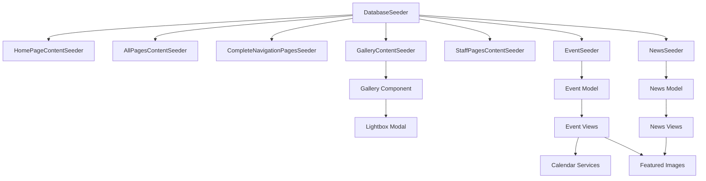

# Design Document: CMS Improvements Implementation

## Overview

This design addresses critical improvements and fixes to the NCTU Graduation Project Laravel CMS. The system currently suffers from incomplete content seeding, broken image displays, debug messages in production views, and database compatibility issues. This implementation will establish a robust seeding orchestration system, add featured image support to events and news, enhance the gallery with lightbox functionality, improve calendar integration, and ensure SQLite compatibility for development environments.

The improvements focus on three main areas:
1. **Database Layer**: Seeder orchestration, schema updates for featured images, SQLite compatibility
2. **Application Layer**: Model updates, service enhancements for calendar integration
3. **Presentation Layer**: View template updates, component enhancements, debug message removal

This is a maintenance and enhancement feature that builds upon existing functionality rather than introducing new business logic. The changes are primarily configuration, template updates, and data population improvements.

## Architecture

### System Context

The CMS follows Laravel's MVC architecture with the following layers:

```
┌─────────────────────────────────────────────────────────┐
│                    Presentation Layer                    │
│  (Blade Templates, View Components, Frontend Assets)    │
└─────────────────────────────────────────────────────────┘
                           │
                           ▼
┌─────────────────────────────────────────────────────────┐
│                   Application Layer                      │
│     (Controllers, Services, Policies, Middleware)        │
└─────────────────────────────────────────────────────────┘
                           │
                           ▼
┌─────────────────────────────────────────────────────────┐
│                      Domain Layer                        │
│        (Eloquent Models, Business Logic)                 │
└─────────────────────────────────────────────────────────┘
                           │
                           ▼
┌─────────────────────────────────────────────────────────┐
│                    Persistence Layer                     │
│         (Database, Migrations, Seeders)                  │
└─────────────────────────────────────────────────────────┘
```

### Component Interactions



### Seeder Execution Flow

The DatabaseSeeder orchestrates all content seeders in dependency order:

1. **Foundation Data** (UserSeeder, MediaSeeder, PageSeeder) - Creates base entities
2. **Content Population** (Content seeders) - Populates pages with content blocks
3. **Media Content** (EventSeeder, NewsSeeder) - Creates events and news with featured images

This ensures pages exist before content blocks are attached, and users exist before being referenced as creators.

## Components and Interfaces

### Database Seeders

#### DatabaseSeeder
**Purpose**: Orchestrate execution of all seeders in correct dependency order

**Interface**:
```php
class DatabaseSeeder extends Seeder
{
    public function run(): void
    {
        $this->call([
            UserSeeder::class,
            MediaSeeder::class,
            PageSeeder::class,
            HomePageContentSeeder::class,
            AllPagesContentSeeder::class,
            CompleteNavigationPagesSeeder::class,
            GalleryContentSeeder::class,
            StaffPagesContentSeeder::class,
            EventSeeder::class,
            NewsSeeder::class,
        ]);
    }
}
```

**Responsibilities**:
- Execute seeders in dependency order
- Ensure pages exist before content blocks
- Ensure users exist before being referenced

#### GalleryContentSeeder
**Purpose**: Create 18 gallery image content blocks with titles and descriptions

**Interface**:
```php
class GalleryContentSeeder extends Seeder
{
    public function run(): void;
    private function createGalleryBlock(Page $page, int $order, array $imageData): void;
}
```

**Data Structure**:
Each gallery block contains:
- `type`: 'image'
- `content`: JSON with `src`, `alt`, `title`, `description`
- `display_order`: Sequential ordering
- `page_id`: Reference to gallery page

#### StaffPagesContentSeeder
**Purpose**: Create enhanced staff portal pages with service cards and features

**Interface**:
```php
class StaffPagesContentSeeder extends Seeder
{
    public function run(): void;
    private function seedProfilePage(Page $page): void;
    private function seedStaffLmsPage(Page $page): void;
}
```

**Content Types**:
- Hero sections
- Service card grids (6 cards for profile page)
- Feature lists
- Quick links sections

### Models

#### Event Model Updates
**Purpose**: Support featured_image field for direct image paths

**Changes**:
```php
protected $fillable = [
    // ... existing fields
    'featured_image',  // NEW: Direct path to image file
];

protected function casts(): array
{
    return [
        // ... existing casts
        'featured_image' => 'string',  // NEW: Cast as string
    ];
}
```

#### News Model Updates
**Purpose**: Support featured_image field for direct image paths

**Changes**:
```php
protected $fillable = [
    // ... existing fields
    'featured_image',  // NEW: Direct path to image file
];

protected function casts(): array
{
    return [
        // ... existing casts
        'featured_image' => 'string',  // NEW: Cast as string
    ];
}
```

### View Components

#### Navbar Component
**Purpose**: Display university logo and navigation menu

**Update**: Change logo path from `uni/img.png` to `img/logo.png`

```blade

```

#### Gallery Grid Component
**Purpose**: Display gallery images with hover effects and lightbox functionality

**Features**:
- Responsive grid layout
- Hover overlay with title and description
- Click to open lightbox modal
- Smooth animations and transitions

**Interface**:
```blade
<x-gallery-grid :images="$images" />
```

**Lightbox Modal Structure**:
```html
<div id="lightbox-modal" class="lightbox-overlay">
    <div class="lightbox-content">
        <button class="lightbox-close">&times;</button>
        
        <div class="lightbox-caption">
            <h4 id="lightbox-title"></h4>
            <p id="lightbox-description"></p>
        </div>
    </div>
</div>
```

### View Templates

#### Event Views (index.blade.php, show.blade.php)
**Purpose**: Display events with featured images and calendar integration

**Image Priority Logic**:
```blade
@if($event->featured_image)
    featured_image) }}" alt="{{ $event->title }}">
@elseif($event->image)
    image->path) }}" alt="{{ $event->title }}">
@else
    title }}">
@endif
```

**Calendar Integration**:
```blade
<div class="dropdown">
    <a href="#" class="dropdown-toggle" data-bs-toggle="dropdown">
        Add to Calendar
    </a>
    <ul class="dropdown-menu">
        <li><a href="[Google Calendar URL]">Google Calendar</a></li>
        <li><a href="[Outlook URL]">Outlook</a></li>
        <li><a href="{{ route('events.export', $event->id) }}">Download .ics</a></li>
    </ul>
</div>
```

#### News Views (index.blade.php, show.blade.php)
**Purpose**: Display news articles with featured images

**Image Priority Logic**:
```blade
@if($article->featured_image)
    featured_image) }}" alt="{{ $article->title }}">
@elseif($article->featuredImage)
    featuredImage->path) }}" alt="{{ $article->title }}">
@else
    title }}">
@endif
```

#### Page View (show.blade.php)
**Purpose**: Display page content without debug messages

**Change**: Remove debug output block that displays page title, block count, and block types

### Calendar Integration

#### Google Calendar URL Format
```
https://calendar.google.com/calendar/render?action=TEMPLATE
&text={event_title}
&dates={start_datetime}/{end_datetime}
&details={event_description}
&location={event_location}
```

#### Outlook Calendar URL Format
```
https://outlook.live.com/calendar/0/deeplink/compose
?subject={event_title}
&startdt={start_iso8601}
&enddt={end_iso8601}
&body={event_description}
&location={event_location}
```

#### ICS File Export
**Route**: `GET /events/{event}/export`

**Controller Method**:
```php
public function export(Event $event)
{
    $ics = "BEGIN:VCALENDAR\r\n";
    $ics .= "VERSION:2.0\r\n";
    $ics .= "BEGIN:VEVENT\r\n";
    $ics .= "DTSTART:" . $event->start_date->format('Ymd\THis\Z') . "\r\n";
    $ics .= "DTEND:" . $event->end_date->format('Ymd\THis\Z') . "\r\n";
    $ics .= "SUMMARY:" . $event->title . "\r\n";
    $ics .= "DESCRIPTION:" . strip_tags($event->description) . "\r\n";
    $ics .= "LOCATION:" . $event->location . "\r\n";
    $ics .= "END:VEVENT\r\n";
    $ics .= "END:VCALENDAR\r\n";
    
    return response($ics)
        ->header('Content-Type', 'text/calendar; charset=utf-8')
        ->header('Content-Disposition', 'attachment; filename="event.ics"');
}
```

## Data Models

### Database Schema Updates

#### Events Table Migration
```php
Schema::table('events', function (Blueprint $table) {
    $table->string('featured_image')->nullable()->after('image_id');
});
```

**Fields**:
- `featured_image`: VARCHAR(255), nullable, stores relative path to image file

#### News Table Migration
```php
Schema::table('news', function (Blueprint $table) {
    $table->string('featured_image')->nullable()->after('featured_image_id');
});
```

**Fields**:
- `featured_image`: VARCHAR(255), nullable, stores relative path to image file

### Content Block Structure

#### Gallery Image Block
```json
{
    "type": "image",
    "content": {
        "src": "img/gallery/campus-building.jpg",
        "alt": "Campus Building",
        "title": "Main Campus Building",
        "description": "The iconic main building of NCTU campus"
    },
    "display_order": 1,
    "page_id": 42
}
```

#### Service Card Block
```json
{
    "type": "card_grid",
    "content": {
        "cards": [
            {
                "title": "Staff Portal",
                "description": "Access your staff dashboard",
                "icon": "fa-user-circle",
                "link": "/staff-lms"
            }
        ]
    },
    "display_order": 2,
    "page_id": 45
}
```

### Default Image Assets

**Location**: `public/img/`

**Files**:
- `default-event.jpg`: Fallback image for events without featured_image
- `default-news.jpg`: Fallback image for news without featured_image
- `logo.png`: University logo for navbar

**Specifications**:
- Format: JPEG for photos, PNG for logo
- Dimensions: 800x600px for default images, flexible for logo
- File size: < 200KB for optimal loading

## Error Handling

### Seeder Error Handling

**Missing Dependencies**:
```php
$admin = User::where('role', 'super_admin')->first();
if (!$admin) {
    $this->command->warn('Admin user not found. Please run UserSeeder first.');
    return;
}
```

**Missing Pages**:
```php
$page = Page::where('slug', 'gallery')->first();
if (!$page) {
    $this->command->error('Gallery page not found. Please run PageSeeder first.');
    return;
}
```

**Duplicate Prevention**:
```php
News::firstOrCreate(
    ['slug' => $articleData['slug']],
    $articleData
);
```

### View Error Handling

**Missing Images**:
- Use null coalescing and fallback chain
- Always provide default image as final fallback
- Log missing image warnings in development

**Missing Data**:
```blade
@if($event->location)
    <small>{{ $event->location }}</small>
@endif
```

### SQLite Compatibility

**Migration Detection**:
```php
public function up()
{
    $driver = DB::connection()->getDriverName();
    
    if ($driver === 'sqlite') {
        Log::warning('Skipping MODIFY COLUMN for SQLite compatibility');
        return;
    }
    
    Schema::table('content_blocks', function (Blueprint $table) {
        $table->text('content')->change();
    });
}
```

**Rationale**: SQLite does not support `ALTER TABLE ... MODIFY COLUMN` syntax. Migrations must detect the database driver and skip incompatible operations.

### Calendar Export Error Handling

**Invalid Event Data**:
```php
if (!$event->start_date || !$event->end_date) {
    abort(400, 'Event dates are required for calendar export');
}
```

**Character Encoding**:
- Strip HTML tags from descriptions
- Escape special characters in ICS format
- Use UTF-8 encoding for all text fields

## Testing Strategy

This feature involves infrastructure configuration, view templates, and data seeding. Property-based testing is not applicable as we are dealing with:
- One-time database seeding operations
- UI rendering and template updates
- Configuration changes for database compatibility
- Simple CRUD enhancements without complex business logic

### Unit Testing

**Seeder Tests**:
- Test each seeder creates expected number of records
- Verify content block structure and associations
- Confirm featured_image paths are correctly assigned
- Validate seeder dependency order

Example:
```php
public function test_gallery_content_seeder_creates_18_images()
{
    $this->seed(GalleryContentSeeder::class);
    
    $galleryPage = Page::where('slug', 'gallery')->first();
    $imageBlocks = $galleryPage->contentBlocks()
        ->where('type', 'image')
        ->count();
    
    $this->assertEquals(18, $imageBlocks);
}
```

**Model Tests**:
- Test Event model includes featured_image in fillable
- Test News model includes featured_image in fillable
- Verify featured_image is cast as string
- Test model relationships remain intact

**View Tests**:
- Test event views render with featured_image
- Test news views render with featured_image
- Verify fallback to default images when featured_image is null
- Confirm debug messages are removed from page views

### Integration Testing

**Seeder Integration**:
- Test DatabaseSeeder executes all seeders without errors
- Verify seeder execution order (pages before content)
- Confirm foreign key relationships are valid
- Test seeder idempotency (can run multiple times safely)

**Calendar Integration**:
- Test Google Calendar URL generation with various event data
- Test Outlook Calendar URL generation
- Test ICS file export produces valid iCalendar format
- Verify calendar links open in new tabs

**Image Display**:
- Test event index page displays featured images
- Test news index page displays featured images
- Verify default images display when featured_image is null
- Test image paths resolve correctly

### Manual Testing Checklist

**Database Seeding**:
- [ ] Run `php artisan migrate:fresh --seed` successfully
- [ ] Verify 54 pages created with content
- [ ] Confirm 18 gallery images display
- [ ] Check staff portal pages have service cards

**Image Display**:
- [ ] Events page shows images for all events
- [ ] News page shows images for all articles
- [ ] Gallery page displays 18 photos
- [ ] Logo appears in navbar

**Calendar Integration**:
- [ ] "Add to Calendar" dropdown displays three options
- [ ] Google Calendar link opens with pre-filled event
- [ ] Outlook link opens with pre-filled event
- [ ] ICS file downloads and imports correctly

**UI/UX**:
- [ ] No debug messages visible on any page
- [ ] Gallery lightbox opens on image click
- [ ] Hover effects work on gallery images
- [ ] All navigation links work without 404 errors

### SQLite Compatibility Testing

**Migration Tests**:
- Test migrations run successfully on SQLite
- Verify MODIFY COLUMN operations are skipped
- Confirm warning messages are logged
- Test migrations run successfully on MySQL/PostgreSQL

**Development Workflow**:
- Test fresh installation with SQLite
- Verify all seeders work with SQLite
- Confirm application functions correctly with SQLite

### Browser Testing

**Supported Browsers**:
- Chrome/Edge (latest)
- Firefox (latest)
- Safari (latest)

**Test Cases**:
- Gallery lightbox functionality
- Calendar dropdown menus
- Image loading and display
- Responsive layout on mobile devices

### Performance Considerations

**Seeder Performance**:
- Batch insert operations where possible
- Use `firstOrCreate` to prevent duplicates
- Minimize database queries in loops

**Image Loading**:
- Use appropriate image dimensions
- Implement lazy loading for gallery images
- Optimize image file sizes

**Database Queries**:
- Eager load relationships (event->image, news->featuredImage)
- Use query scopes for filtering
- Index foreign key columns

## Implementation Notes

### Seeder Execution Order

The order is critical to avoid foreign key constraint violations:

1. **UserSeeder** - Creates users (referenced by created_by fields)
2. **MediaSeeder** - Creates media records (referenced by image_id fields)
3. **PageSeeder** - Creates pages (referenced by page_id in content blocks)
4. **Content Seeders** - Create content blocks (require pages to exist)
5. **EventSeeder** - Creates events (requires users)
6. **NewsSeeder** - Creates news (requires users)

### Featured Image vs Media Relationship

The system supports two approaches for images:

1. **featured_image** (string): Direct file path, simpler, no database relationship
2. **image_id** (foreign key): Media table relationship, more complex, supports metadata

Views prioritize `featured_image` over media relationship for backward compatibility and simplicity.

### SQLite Limitations

SQLite does not support:
- `ALTER TABLE ... MODIFY COLUMN`
- `ALTER TABLE ... CHANGE COLUMN`
- Full-text search with `MATCH ... AGAINST`

Migrations must detect SQLite and skip incompatible operations. For production, use MySQL or PostgreSQL.

### Content Block Types

The system supports multiple content block types:
- `text`: Rich text content
- `hero`: Hero section with image and CTA
- `card_grid`: Grid of cards with icons
- `image`: Single image with caption
- `video`: Video embed
- `faq`: FAQ accordion
- `testimonial`: Testimonial carousel
- `contact_form`: Contact form

Each type has a corresponding Blade component in `resources/views/components/`.

### Calendar Service Compatibility

**Google Calendar**:
- Supports all major browsers
- Requires Google account
- URL format is stable and well-documented

**Outlook Calendar**:
- Works with Outlook.com and Office 365
- Requires Microsoft account
- URL format may change, monitor Microsoft documentation

**ICS Files**:
- Universal format supported by all calendar applications
- Works offline
- Requires user to manually import file

### Asset Management

**Public Assets**:
- Store in `public/img/` directory
- Reference with `asset()` helper
- Version control images under 1MB

**Storage Assets**:
- Store in `storage/app/public/` directory
- Create symlink with `php artisan storage:link`
- Reference with `asset('storage/...')`

For this implementation, use public assets for simplicity and direct access.

