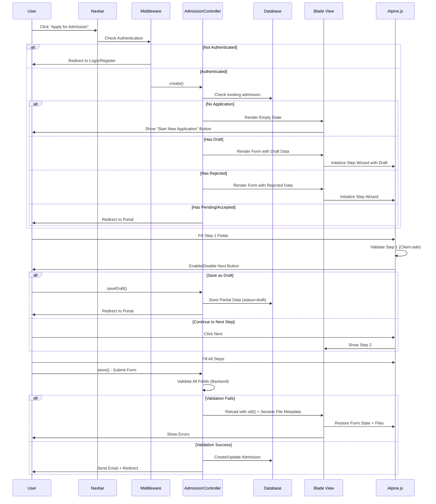

# Design Document: Student Application Refactor

## Overview

This design refactors the existing Laravel monolith student admission system to implement a multi-step wizard form with enhanced UX features including authentication enforcement, smart auto-fill, empty state UI, step-by-step validation, data retention on validation failure, and draft-saving capabilities. The solution maintains strict monolith architecture using Blade templates, web controllers, Alpine.js for client-side interactivity, and Tailwind CSS for styling.

The refactor addresses six core requirements: (1) navbar authentication enforcement with guest redirection, (2) partial auto-fill of email field only, (3) empty state dashboard UI, (4) multi-step wizard with client-side validation, (5) comprehensive data and file retention on backend validation failure, and (6) draft-saving functionality allowing students to resume incomplete applications.

## Architecture

```mermaid
graph TD
    A[Guest User] -->|Clicks Apply| B{Authenticated?}
    B -->|No| C[Redirect to Login/Register]
    B -->|Yes| D{Has Application?}
    D -->|No| E[Show Empty State Dashboard]
    D -->|Yes - Pending/Accepted| F[Show Portal with Status]
    D -->|Yes - Rejected| G[Show Form with Auto-fill]
    D -->|Yes - Draft| H[Show Form with Draft Data]
    
    E -->|Click Start Application| I[Multi-Step Wizard Form]
    G -->|Re-apply| I
    H -->|Continue Draft| I
    
    I -->|Step 1: Personal Info| J[Client Validation]
    J -->|Valid| K[Enable Next Button]
    K -->|Click Next| L[Step 2: Academic/Documents]
    L -->|Client Validation| M[Enable Next Button]
    M -->|Click Next| N[Step 3: Parent Info]
    
    I -->|Save as Draft| O[Store Partial Data]
    O -->|Success| P[Redirect to Portal]
    
    N -->|Submit| Q[Backend Validation]
    Q -->|Fail| R[Reload with old() + File Metadata]
    Q -->|Success| S[Store Application]
    S -->|Email Notification| T[Redirect to Home]
```

## Main Workflow Sequence



## Components and Interfaces

### Component 1: AdmissionController (Enhanced)

**Purpose**: Handles admission form display, draft saving, and final submission with comprehensive validation and file retention logic.

**Interface**:
```php
class AdmissionController extends Controller
{
    public function create(): View|RedirectResponse;
    public function store(Request $request): RedirectResponse;
    public function saveDraft(Request $request): RedirectResponse;
    private function validateStep(Request $request, int $step): array;
    private function storeFileMetadataInSession(Request $request): void;
    private function restoreFilesFromSession(Request $request): array;
    private function clearFileSession(): void;
}
```

**Responsibilities**:
- Check authentication and existing application status
- Render appropriate view (empty state, form with draft, form with rejected data)
- Auto-fill email field from authenticated user
- Handle draft saving with minimal validation
- Handle final submission with full validation
- Store file metadata in session on validation failure
- Restore file metadata from session on form reload
- Clean up session data after successful submission

### Component 2: StudentPortalController (Enhanced)

**Purpose**: Displays student dashboard with empty state UI when no application exists.

**Interface**:
```php
class StudentPortalController extends Controller
{
    public function index(): View;
    public function editProfile(): View;
    public function updateProfile(Request $request): RedirectResponse;
    public function editPassword(): View;
    public function updatePassword(Request $request): RedirectResponse;
    public function deleteApplication(): RedirectResponse;
}
```

**Responsibilities**:
- Display empty state UI when no application exists
- Show application status when application exists
- Handle profile and password updates
- Allow deletion of pending applications


### Component 3: Multi-Step Wizard (Alpine.js Component)

**Purpose**: Client-side step navigation, validation, and state management for the multi-step form.

**Interface**:
```javascript
Alpine.data('admissionWizard', () => ({
    currentStep: 1,
    totalSteps: 3,
    formData: {},
    validationErrors: {},
    
    // Navigation
    nextStep(): void,
    prevStep(): void,
    goToStep(step: number): void,
    
    // Validation
    validateCurrentStep(): boolean,
    validateField(fieldName: string): boolean,
    isStepValid(step: number): boolean,
    
    // State Management
    canProceed(): boolean,
    isFirstStep(): boolean,
    isLastStep(): boolean,
    getStepTitle(step: number): string,
    
    // File Handling
    handleFileUpload(event: Event, fieldName: string): void,
    hasFileUploaded(fieldName: string): boolean
}))
```

**Responsibilities**:
- Manage current step state
- Validate fields in current step before allowing navigation
- Enable/disable Next button based on validation
- Show/hide steps dynamically
- Display progress indicator
- Handle file upload preview and validation
- Preserve form state during navigation


### Component 4: Navbar (Enhanced)

**Purpose**: Display authentication-aware navigation with conditional "Apply" link behavior.

**Interface**:
```php
// Blade Template Logic
@auth
    <a href="{{ route('admission.create') }}">Apply for Admission</a>
@else
    <a href="{{ route('login') }}?redirect={{ route('admission.create') }}">Apply for Admission</a>
@endauth
```

**Responsibilities**:
- Show appropriate links based on authentication state
- Redirect guests to login with return URL
- Display user profile/dashboard icon when authenticated

### Component 5: Empty State Component (Blade Partial)

**Purpose**: Beautiful UI component shown when student has no applications.

**Interface**:
```php
// resources/views/student/partials/empty-state.blade.php
@props(['actionRoute', 'title', 'description', 'buttonText'])

<div class="empty-state-container">
    <div class="empty-state-icon"><!-- SVG Icon --></div>
    <h2>{{ $title }}</h2>
    <p>{{ $description }}</p>
    <a href="{{ $actionRoute }}" class="btn-primary">{{ $buttonText }}</a>
</div>
```

**Responsibilities**:
- Display visually appealing empty state
- Provide clear call-to-action button
- Guide user to start new application


## Data Models

### Model 1: Admission (Enhanced)

```php
class Admission extends Model
{
    protected $fillable = [
        'user_id',
        'national_id',
        'first_name',
        'second_name',
        'third_name',
        'fourth_name',
        'gender',
        'religion',
        'birth_date',
        'birth_governorate',
        'current_governorate',
        'city_center',
        'village_district',
        'street_address',
        'phone',
        'email',
        'student_photo',
        'birth_certificate',
        'qualification_certificate',
        'student_id_document',
        'parent_name',
        'parent_phone',
        'father_occupation',
        'parent_id_document',
        'status', // NEW: 'draft', 'pending', 'accepted', 'rejected'
        'student_code',
        'rejection_reason',
        'reviewed_at',
        'reviewed_by',
    ];
    
    protected $casts = [
        'birth_date' => 'date',
        'reviewed_at' => 'datetime',
    ];
}
```

**Validation Rules**:
- `status`: Must be one of: 'draft', 'pending', 'accepted', 'rejected'
- Draft status: Allows partial data (minimal validation)
- Pending status: Requires all fields (full validation)
- National ID: Unique per user (excluding current user's own records)
- Files: Required on first submission, optional on re-submission if already uploaded


### Model 2: Session File Metadata Structure

```php
// Session structure for file retention
[
    'admission_files' => [
        'student_photo' => [
            'original_name' => 'photo.jpg',
            'temp_path' => 'temp/uploads/abc123.jpg',
            'mime_type' => 'image/jpeg',
            'size' => 204800,
            'uploaded_at' => '2024-01-15 10:30:00'
        ],
        'birth_certificate' => [
            'original_name' => 'birth_cert.pdf',
            'temp_path' => 'temp/uploads/def456.pdf',
            'mime_type' => 'application/pdf',
            'size' => 512000,
            'uploaded_at' => '2024-01-15 10:31:00'
        ],
        // ... other files
    ],
    'admission_files_expires_at' => '2024-01-15 12:30:00' // 2 hours from upload
]
```

**Validation Rules**:
- Temporary files stored in `storage/app/temp/uploads/`
- Session expires after 2 hours
- Files automatically cleaned up on successful submission or expiration
- Original filename preserved for display
- MIME type validated on retrieval


## Algorithmic Pseudocode

### Main Processing Algorithm: Form Submission

```pascal
ALGORITHM processAdmissionSubmission(request, isDraft)
INPUT: request (HTTP request with form data), isDraft (boolean flag)
OUTPUT: redirectResponse (success or validation error)

PRECONDITIONS:
  - User is authenticated
  - Request contains form data
  - isDraft is boolean value

POSTCONDITIONS:
  - If successful: Admission record created/updated in database
  - If validation fails: Session contains file metadata for retention
  - Temporary files cleaned up on success
  - User redirected to appropriate page

BEGIN
  ASSERT user is authenticated
  
  // Step 1: Check existing admission status
  existingAdmission ← findAdmissionByUserId(auth.userId)
  
  IF existingAdmission EXISTS AND existingAdmission.status IN ['pending', 'accepted'] THEN
    RETURN redirectToPortal("You already have an active application")
  END IF
  
  isReapplication ← (existingAdmission EXISTS AND existingAdmission.status = 'rejected')
  
  // Step 2: Determine validation rules based on submission type
  IF isDraft = true THEN
    validationRules ← getMinimalValidationRules()
  ELSE
    validationRules ← getFullValidationRules(isReapplication)
  END IF
  
  // Step 3: Validate request data
  TRY
    validated ← validateRequest(request, validationRules)
  CATCH ValidationException AS e
    // Store uploaded files in session for retention
    storeFileMetadataInSession(request.files)
    RETURN redirectBack().withErrors(e.errors).withInput()
  END TRY
  
  // Step 4: Begin database transaction
  BEGIN TRANSACTION
  
  TRY
    // Step 5: Prepare admission data
    admissionData ← prepareAdmissionData(validated, auth.userId)
    
    // Step 6: Handle file uploads
    IF isDraft = false THEN
      admissionData ← processFileUploads(request, admissionData, isReapplication, existingAdmission)
    END IF
    
    // Step 7: Set status
    IF isDraft = true THEN
      admissionData.status ← 'draft'
    ELSE
      admissionData.status ← 'pending'
    END IF
    
    // Step 8: Create or update admission record
    IF isReapplication = true THEN
      admission ← updateAdmission(existingAdmission, admissionData)
    ELSE IF existingAdmission EXISTS AND existingAdmission.status = 'draft' THEN
      admission ← updateAdmission(existingAdmission, admissionData)
    ELSE
      admission ← createAdmission(admissionData)
    END IF
    
    // Step 9: Commit transaction
    COMMIT TRANSACTION
    
    // Step 10: Clean up session files
    clearFileSession()
    
    // Step 11: Send email notification (only for final submission)
    IF isDraft = false THEN
      TRY
        sendAdmissionSubmittedEmail(admission)
      CATCH EmailException AS e
        logError("Email failed", e)
        // Continue anyway - admission is saved
      END TRY
    END IF
    
    // Step 12: Redirect with success message
    IF isDraft = true THEN
      RETURN redirectToPortal("Draft saved successfully")
    ELSE
      RETURN redirectToHome("Application submitted successfully")
    END IF
    
  CATCH Exception AS e
    // Rollback transaction
    ROLLBACK TRANSACTION
    
    // Clean up uploaded files (only new uploads)
    IF isReapplication = false THEN
      cleanupUploadedFiles(admissionData)
    END IF
    
    logError("Admission submission failed", e)
    RETURN redirectBack().withErrors("Submission failed").withInput()
  END TRY
END
```


### File Retention Algorithm

```pascal
ALGORITHM storeFileMetadataInSession(uploadedFiles)
INPUT: uploadedFiles (collection of uploaded file objects)
OUTPUT: void (stores metadata in session)

PRECONDITIONS:
  - uploadedFiles is a valid collection
  - Session is available

POSTCONDITIONS:
  - File metadata stored in session
  - Temporary files moved to temp storage
  - Expiration timestamp set

BEGIN
  fileMetadata ← empty array
  expirationTime ← currentTime() + 2 hours
  
  FOR EACH file IN uploadedFiles DO
    IF file IS NOT NULL THEN
      // Generate unique temporary filename
      tempFilename ← generateUniqueId() + '.' + file.extension
      tempPath ← 'temp/uploads/' + tempFilename
      
      // Move file to temporary storage
      moveFile(file, tempPath)
      
      // Store metadata
      fileMetadata[file.fieldName] ← {
        'original_name': file.originalName,
        'temp_path': tempPath,
        'mime_type': file.mimeType,
        'size': file.size,
        'uploaded_at': currentTime()
      }
    END IF
  END FOR
  
  // Store in session
  session.put('admission_files', fileMetadata)
  session.put('admission_files_expires_at', expirationTime)
END
```

```pascal
ALGORITHM restoreFilesFromSession()
INPUT: none (reads from session)
OUTPUT: restoredFiles (array of file metadata for display)

PRECONDITIONS:
  - Session is available

POSTCONDITIONS:
  - Returns file metadata if valid and not expired
  - Cleans up expired files
  - Returns empty array if no files or expired

BEGIN
  IF session.has('admission_files') = false THEN
    RETURN empty array
  END IF
  
  expiresAt ← session.get('admission_files_expires_at')
  
  // Check expiration
  IF currentTime() > expiresAt THEN
    cleanupExpiredFiles()
    RETURN empty array
  END IF
  
  fileMetadata ← session.get('admission_files')
  restoredFiles ← empty array
  
  FOR EACH fieldName, metadata IN fileMetadata DO
    // Verify file still exists
    IF fileExists(metadata.temp_path) THEN
      restoredFiles[fieldName] ← metadata
    END IF
  END FOR
  
  RETURN restoredFiles
END
```


### Client-Side Step Validation Algorithm

```pascal
ALGORITHM validateCurrentStep(stepNumber, formData)
INPUT: stepNumber (integer 1-3), formData (object with form field values)
OUTPUT: isValid (boolean), errors (array of error messages)

PRECONDITIONS:
  - stepNumber is between 1 and 3
  - formData contains all form fields

POSTCONDITIONS:
  - Returns true if all required fields in step are valid
  - Returns false and error messages if validation fails
  - Does not modify formData

BEGIN
  errors ← empty array
  
  CASE stepNumber OF
    1: // Personal Information Step
      // National ID validation
      IF formData.national_id IS EMPTY THEN
        errors.add('national_id', 'National ID is required')
      ELSE IF length(formData.national_id) ≠ 14 THEN
        errors.add('national_id', 'National ID must be 14 digits')
      ELSE IF NOT isNumeric(formData.national_id) THEN
        errors.add('national_id', 'National ID must contain only numbers')
      END IF
      
      // Name fields validation
      requiredNameFields ← ['first_name', 'second_name', 'third_name', 'fourth_name']
      FOR EACH field IN requiredNameFields DO
        IF formData[field] IS EMPTY THEN
          errors.add(field, field + ' is required')
        END IF
      END FOR
      
      // Gender and Religion validation
      IF formData.gender IS EMPTY THEN
        errors.add('gender', 'Gender is required')
      END IF
      
      IF formData.religion IS EMPTY THEN
        errors.add('religion', 'Religion is required')
      END IF
      
      // Birth date validation
      IF formData.birth_date IS EMPTY THEN
        errors.add('birth_date', 'Birth date is required')
      ELSE IF formData.birth_date >= currentDate() THEN
        errors.add('birth_date', 'Birth date must be in the past')
      END IF
      
      // Address fields validation
      addressFields ← ['current_governorate', 'city_center', 'village_district', 'street_address']
      FOR EACH field IN addressFields DO
        IF formData[field] IS EMPTY THEN
          errors.add(field, field + ' is required')
        END IF
      END FOR
      
      // Phone validation
      IF formData.phone IS EMPTY THEN
        errors.add('phone', 'Phone number is required')
      ELSE IF NOT matchesPattern(formData.phone, '^01[0125][0-9]{8}$') THEN
        errors.add('phone', 'Invalid Egyptian phone number')
      END IF
    
    2: // Academic/Documents Step
      // File upload validation
      requiredFiles ← ['student_photo', 'birth_certificate', 'qualification_certificate', 'student_id_document']
      
      FOR EACH fileField IN requiredFiles DO
        IF hasExistingFile(fileField) = false AND hasNewUpload(fileField) = false THEN
          errors.add(fileField, fileField + ' is required')
        END IF
      END FOR
      
      // Validate file types if new uploads
      IF hasNewUpload('student_photo') THEN
        IF NOT isImageFile(formData.student_photo) THEN
          errors.add('student_photo', 'Photo must be an image (JPEG, PNG, JPG)')
        ELSE IF fileSize(formData.student_photo) > 2MB THEN
          errors.add('student_photo', 'Photo must be less than 2MB')
        END IF
      END IF
      
      pdfFields ← ['birth_certificate', 'qualification_certificate', 'student_id_document']
      FOR EACH pdfField IN pdfFields DO
        IF hasNewUpload(pdfField) THEN
          IF NOT isPdfFile(formData[pdfField]) THEN
            errors.add(pdfField, pdfField + ' must be a PDF file')
          ELSE IF fileSize(formData[pdfField]) > 5MB THEN
            errors.add(pdfField, pdfField + ' must be less than 5MB')
          END IF
        END IF
      END FOR
    
    3: // Parent Information Step
      // Parent name validation
      IF formData.parent_name IS EMPTY THEN
        errors.add('parent_name', 'Parent name is required')
      END IF
      
      // Parent phone validation
      IF formData.parent_phone IS EMPTY THEN
        errors.add('parent_phone', 'Parent phone is required')
      ELSE IF NOT matchesPattern(formData.parent_phone, '^01[0125][0-9]{8}$') THEN
        errors.add('parent_phone', 'Invalid Egyptian phone number')
      ELSE IF formData.parent_phone = formData.phone THEN
        errors.add('parent_phone', 'Parent phone must be different from student phone')
      END IF
      
      // Father occupation validation
      IF formData.father_occupation IS EMPTY THEN
        errors.add('father_occupation', 'Father occupation is required')
      END IF
      
      // Parent ID document validation
      IF hasExistingFile('parent_id_document') = false AND hasNewUpload('parent_id_document') = false THEN
        errors.add('parent_id_document', 'Parent ID document is required')
      ELSE IF hasNewUpload('parent_id_document') THEN
        IF NOT isPdfFile(formData.parent_id_document) THEN
          errors.add('parent_id_document', 'Parent ID document must be a PDF file')
        ELSE IF fileSize(formData.parent_id_document) > 5MB THEN
          errors.add('parent_id_document', 'Parent ID document must be less than 5MB')
        END IF
      END IF
  END CASE
  
  isValid ← (length(errors) = 0)
  RETURN isValid, errors
END
```


## Key Functions with Formal Specifications

### Function 1: AdmissionController::create()

```php
public function create(): View|RedirectResponse
```

**Preconditions:**
- User is authenticated (enforced by middleware)
- User has valid session

**Postconditions:**
- Returns View with appropriate data OR RedirectResponse
- If no application exists: Returns view with empty state flag
- If draft exists: Returns view with draft data pre-filled
- If rejected exists: Returns view with rejected data pre-filled
- If pending/accepted exists: Redirects to student portal
- Email field auto-filled from authenticated user's email
- All other fields left blank (no auto-fill from username)

**Loop Invariants:** N/A (no loops in function)

### Function 2: AdmissionController::saveDraft()

```php
public function saveDraft(Request $request): RedirectResponse
```

**Preconditions:**
- User is authenticated
- Request contains partial form data
- User does not have pending or accepted application

**Postconditions:**
- Admission record created or updated with status='draft'
- Minimal validation applied (only required: user_id, email)
- No file uploads required for draft
- User redirected to student portal
- Success message displayed
- No email notification sent

**Loop Invariants:** N/A (no loops in function)


### Function 3: AdmissionController::store()

```php
public function store(Request $request): RedirectResponse
```

**Preconditions:**
- User is authenticated
- Request contains complete form data
- User does not have pending or accepted application

**Postconditions:**
- If validation succeeds:
  - Admission record created or updated with status='pending'
  - All files uploaded to storage
  - Session file metadata cleared
  - Email notification sent (best effort)
  - User redirected to home with success message
- If validation fails:
  - File metadata stored in session
  - User redirected back with errors
  - All text data preserved via old() helper
  - File upload indicators shown for previously uploaded files

**Loop Invariants:**
- For file upload loop: All successfully uploaded files are stored in correct directory
- For validation loop: All validation rules are applied consistently

### Function 4: AdmissionController::storeFileMetadataInSession()

```php
private function storeFileMetadataInSession(Request $request): void
```

**Preconditions:**
- Request contains uploaded files
- Session is available and writable

**Postconditions:**
- All uploaded files moved to temporary storage
- File metadata stored in session with structure:
  - original_name: string
  - temp_path: string
  - mime_type: string
  - size: integer
  - uploaded_at: timestamp
- Expiration timestamp set to current time + 2 hours
- No files lost during process

**Loop Invariants:**
- For each file processed: File is successfully moved to temp storage before metadata is stored
- All file metadata entries are complete and valid
