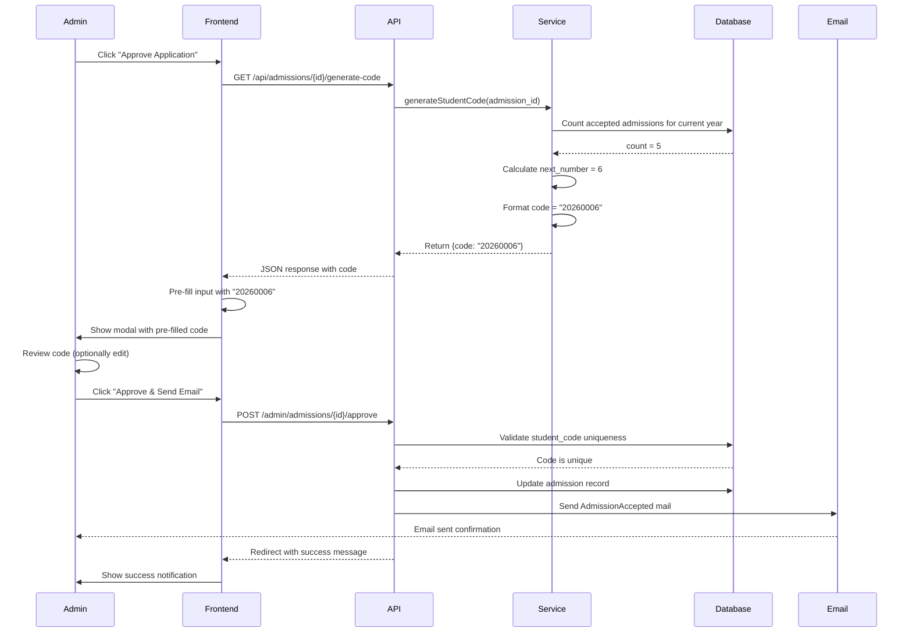
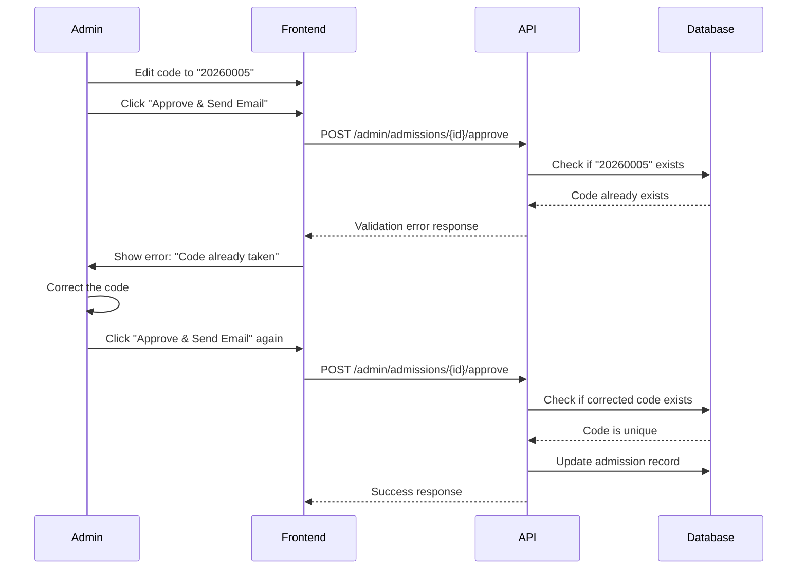

# Design Document: Student Code Auto-Generation

## Overview

The Student Code Auto-Generation feature automatically generates an 8-digit unique student code when an admin approves a student admission application. The code follows the format YYYYNNNN where YYYY is the current academic year and NNNN is a zero-padded chronological number within that year's batch. The generated code is pre-filled in the approval modal, allowing admins to review and optionally edit it before final confirmation.

This feature enhances the admission workflow by eliminating manual code entry errors, ensuring consistency in code format, and preventing duplicate codes through automatic validation.

## Architecture

```mermaid
graph TD
    A[Admin clicks Approve] --> B[Frontend: showApproveModal]
    B --> C[AJAX Request: /api/admissions/{id}/generate-code]
    C --> D[Backend: StudentCodeGenerator Service]
    D --> E[Query: Count accepted students for current year]
    E --> F[Calculate: next_number = count + 1]
    F --> G[Format: YYYY + zero-pad next_number]
    G --> H[Return generated code to frontend]
    H --> I[Pre-fill student_code input field]
    I --> J[Admin reviews/edits code]
    J --> K[Admin clicks Confirm]
    K --> L[POST: /admin/admissions/{id}/approve]
    L --> M[Validate: unique student_code]
    M --> N[Save: status=accepted, student_code]
    N --> O[Send: AdmissionAccepted email]
    O --> P[Redirect: success message]
```

## Sequence Diagrams

### Main Flow: Approve with Auto-Generated Code




### Edge Case: Duplicate Code Detection



## Components and Interfaces

### Component 1: StudentCodeGenerator Service

**Purpose**: Encapsulates the business logic for generating unique student codes based on academic year and batch sequence.

**Interface**:
```php
interface StudentCodeGeneratorInterface
{
    public function generate(int $admissionId): string;
    public function getCurrentAcademicYear(): int;
    public function getNextSequenceNumber(int $year): int;
    public function formatCode(int $year, int $sequence): string;
}
```

**Responsibilities**:
- Calculate the current academic year
- Query the database for the count of accepted students in the current year
- Generate the next sequential number
- Format the 8-digit code (YYYYNNNN)
- Return the generated code


### Component 2: API Controller (AdmissionsApiController)

**Purpose**: Provides RESTful API endpoint for generating student codes via AJAX requests from the frontend.

**Interface**:
```php
class AdmissionsApiController extends Controller
{
    public function generateCode(int $admissionId): JsonResponse;
}
```

**Responsibilities**:
- Receive AJAX request for code generation
- Validate admission exists and is pending
- Delegate code generation to StudentCodeGenerator service
- Return JSON response with generated code
- Handle errors gracefully

### Component 3: Frontend JavaScript Module

**Purpose**: Handles the client-side logic for fetching and displaying the auto-generated code in the approval modal.

**Interface**:
```javascript
// Modal management functions
function showApproveModal(): void;
function hideApproveModal(): void;
function fetchAndFillStudentCode(admissionId: number): Promise<void>;
```

**Responsibilities**:
- Trigger AJAX request when approve button is clicked
- Fetch generated code from API endpoint
- Pre-fill the student_code input field
- Display loading state during fetch
- Handle fetch errors with user-friendly messages

### Component 4: AdmissionsController (Enhanced)

**Purpose**: Processes the approval submission with the student code (auto-generated or manually edited).

**Interface**:
```php
class AdmissionsController extends Controller
{
    public function approve(Request $request, Admission $admission): RedirectResponse;
}
```

**Responsibilities**:
- Validate student_code is provided and unique
- Update admission status to 'accepted'
- Store student_code in database
- Send acceptance email with student code
- Redirect with success message


## Data Models

### Admission Model (Enhanced)

```php
class Admission extends Model
{
    protected $fillable = [
        // ... existing fields ...
        'student_code',  // varchar(255), nullable, unique
        'status',        // enum('pending', 'accepted', 'rejected')
        'reviewed_at',   // timestamp
        'reviewed_by',   // bigint unsigned
    ];
    
    protected $casts = [
        'reviewed_at' => 'datetime',
    ];
}
```

**Validation Rules**:
- `student_code` must be exactly 8 digits
- `student_code` must be unique across all admissions
- `student_code` format: YYYYNNNN (year + 4-digit sequence)
- `student_code` is required when status changes to 'accepted'

### API Response Model

```php
interface GenerateCodeResponse
{
    public string $code;        // Generated 8-digit code
    public int $year;           // Current academic year
    public int $sequence;       // Sequence number in batch
    public bool $success;       // Operation success status
}
```

**Example Response**:
```json
{
    "code": "20260006",
    "year": 2026,
    "sequence": 6,
    "success": true
}
```

## Algorithmic Pseudocode

### Main Code Generation Algorithm

```pascal
ALGORITHM generateStudentCode(admissionId)
INPUT: admissionId of type Integer
OUTPUT: studentCode of type String (8 digits)

BEGIN
  ASSERT admissionId > 0
  
  // Step 1: Get current academic year
  currentYear ← getCurrentAcademicYear()
  ASSERT currentYear >= 2024 AND currentYear <= 2100
  
  // Step 2: Count accepted students for current year
  acceptedCount ← countAcceptedStudentsForYear(currentYear)
  ASSERT acceptedCount >= 0
  
  // Step 3: Calculate next sequence number
  nextSequence ← acceptedCount + 1
  ASSERT nextSequence >= 1 AND nextSequence <= 9999
  
  // Step 4: Format the code
  studentCode ← formatCode(currentYear, nextSequence)
  ASSERT length(studentCode) = 8
  ASSERT isNumeric(studentCode)
  
  RETURN studentCode
END
```


**Preconditions:**
- admissionId exists in database
- admissionId corresponds to a pending admission
- Database connection is available

**Postconditions:**
- Returns valid 8-digit string
- Code format is YYYYNNNN
- Code is unique (not yet in database)
- No side effects on database

**Loop Invariants:** N/A (no loops in main algorithm)

### Helper Algorithm: Count Accepted Students

```pascal
ALGORITHM countAcceptedStudentsForYear(year)
INPUT: year of type Integer
OUTPUT: count of type Integer

BEGIN
  ASSERT year >= 2024 AND year <= 2100
  
  // Extract year prefix from student codes
  yearPrefix ← toString(year)
  ASSERT length(yearPrefix) = 4
  
  // Query database for accepted admissions with matching year prefix
  count ← 0
  FOR each admission IN database.admissions DO
    IF admission.status = 'accepted' AND 
       admission.student_code IS NOT NULL AND
       startsWith(admission.student_code, yearPrefix) THEN
      count ← count + 1
    END IF
  END FOR
  
  ASSERT count >= 0
  RETURN count
END
```

**Preconditions:**
- year is a valid 4-digit integer
- Database connection is available

**Postconditions:**
- Returns non-negative integer
- Count represents exact number of accepted students for given year

**Loop Invariants:**
- count remains non-negative throughout iteration
- All previously checked admissions with matching criteria have been counted

### Helper Algorithm: Format Code

```pascal
ALGORITHM formatCode(year, sequence)
INPUT: year of type Integer, sequence of type Integer
OUTPUT: formattedCode of type String

BEGIN
  ASSERT year >= 2024 AND year <= 2100
  ASSERT sequence >= 1 AND sequence <= 9999
  
  // Convert year to string (4 digits)
  yearString ← toString(year)
  ASSERT length(yearString) = 4
  
  // Convert sequence to zero-padded string (4 digits)
  sequenceString ← zeroPad(sequence, 4)
  ASSERT length(sequenceString) = 4
  
  // Concatenate year and sequence
  formattedCode ← yearString + sequenceString
  ASSERT length(formattedCode) = 8
  ASSERT isNumeric(formattedCode)
  
  RETURN formattedCode
END
```


**Preconditions:**
- year is valid 4-digit integer
- sequence is between 1 and 9999

**Postconditions:**
- Returns exactly 8-character string
- First 4 characters are the year
- Last 4 characters are zero-padded sequence
- Result is all numeric

**Loop Invariants:** N/A (no loops)

## Key Functions with Formal Specifications

### Function 1: StudentCodeGenerator::generate()

```php
public function generate(int $admissionId): string
```

**Preconditions:**
- `$admissionId` is a positive integer
- Admission with `$admissionId` exists in database
- Admission status is 'pending'
- Database connection is active

**Postconditions:**
- Returns a string of exactly 8 numeric characters
- Format matches YYYYNNNN pattern
- First 4 digits represent current academic year (2024-2100)
- Last 4 digits represent sequence number (0001-9999)
- Generated code is unique (not currently in database)
- No database modifications occur

**Loop Invariants:** N/A

### Function 2: StudentCodeGenerator::getCurrentAcademicYear()

```php
public function getCurrentAcademicYear(): int
```

**Preconditions:**
- System date/time is available and accurate

**Postconditions:**
- Returns 4-digit integer representing current year
- Return value is between 2024 and 2100
- No side effects

**Loop Invariants:** N/A


### Function 3: StudentCodeGenerator::getNextSequenceNumber()

```php
public function getNextSequenceNumber(int $year): int
```

**Preconditions:**
- `$year` is a valid 4-digit integer (2024-2100)
- Database connection is active

**Postconditions:**
- Returns positive integer between 1 and 9999
- Return value equals (count of accepted students for year) + 1
- No database modifications occur

**Loop Invariants:**
- When iterating through admissions: all previously checked records with matching year prefix have been counted

### Function 4: StudentCodeGenerator::formatCode()

```php
public function formatCode(int $year, int $sequence): string
```

**Preconditions:**
- `$year` is between 2024 and 2100
- `$sequence` is between 1 and 9999

**Postconditions:**
- Returns string of exactly 8 characters
- All characters are numeric digits
- First 4 characters equal string representation of `$year`
- Last 4 characters equal zero-padded string representation of `$sequence`
- No side effects

**Loop Invariants:** N/A

### Function 5: AdmissionsApiController::generateCode()

```php
public function generateCode(int $admissionId): JsonResponse
```

**Preconditions:**
- `$admissionId` is a positive integer
- HTTP request is authenticated as admin user
- Admission with `$admissionId` exists

**Postconditions:**
- Returns JsonResponse with HTTP status 200 on success
- Response contains 'code', 'year', 'sequence', 'success' fields
- Returns JsonResponse with HTTP status 404 if admission not found
- Returns JsonResponse with HTTP status 400 if admission not pending
- No database modifications occur

**Loop Invariants:** N/A


## Example Usage

### Example 1: Service Usage in Controller

```php
// In AdmissionsApiController
use App\Services\StudentCodeGenerator;

public function generateCode(int $admissionId): JsonResponse
{
    $admission = Admission::find($admissionId);
    
    if (!$admission) {
        return response()->json([
            'success' => false,
            'message' => 'Admission not found'
        ], 404);
    }
    
    if ($admission->status !== 'pending') {
        return response()->json([
            'success' => false,
            'message' => 'Admission is not pending'
        ], 400);
    }
    
    $generator = new StudentCodeGenerator();
    $code = $generator->generate($admissionId);
    
    return response()->json([
        'success' => true,
        'code' => $code,
        'year' => $generator->getCurrentAcademicYear(),
        'sequence' => (int) substr($code, 4)
    ]);
}
```

### Example 2: Frontend AJAX Call

```javascript
// In show.blade.php
async function showApproveModal() {
    const modal = document.getElementById('approveModal');
    const codeInput = document.querySelector('input[name="student_code"]');
    const admissionId = {{ $admission->id }};
    
    // Show modal immediately
    modal.classList.remove('hidden');
    
    // Show loading state
    codeInput.value = 'Loading...';
    codeInput.disabled = true;
    
    try {
        const response = await fetch(`/api/admissions/${admissionId}/generate-code`);
        const data = await response.json();
        
        if (data.success) {
            codeInput.value = data.code;
            codeInput.disabled = false;
        } else {
            codeInput.value = '';
            alert('Failed to generate code: ' + data.message);
        }
    } catch (error) {
        codeInput.value = '';
        codeInput.disabled = false;
        alert('Error generating code. Please enter manually.');
    }
}
```


### Example 3: Complete Workflow

```php
// Scenario: Admin approves student in 2026, 5 students already accepted

// Step 1: Frontend calls API
GET /api/admissions/123/generate-code

// Step 2: Service generates code
$generator = new StudentCodeGenerator();
$year = $generator->getCurrentAcademicYear(); // 2026
$count = $generator->getNextSequenceNumber(2026); // 6 (5 existing + 1)
$code = $generator->formatCode(2026, 6); // "20260006"

// Step 3: API returns response
{
    "success": true,
    "code": "20260006",
    "year": 2026,
    "sequence": 6
}

// Step 4: Frontend pre-fills input
<input name="student_code" value="20260006">

// Step 5: Admin submits approval
POST /admin/admissions/123/approve
{
    "student_code": "20260006"
}

// Step 6: Controller validates and saves
$admission->status = 'accepted';
$admission->student_code = '20260006';
$admission->save();

// Step 7: Email sent with code
Mail::to($admission->email)->send(new AdmissionAccepted($admission));
```

## Correctness Properties

### Property 1: Code Format Invariant
**∀ code generated by system: code matches pattern /^\d{8}$/ ∧ code[0:4] represents valid year ∧ code[4:8] represents valid sequence**

All generated student codes must be exactly 8 numeric digits, where the first 4 digits represent a valid academic year (2024-2100) and the last 4 digits represent a valid sequence number (0001-9999).

### Property 2: Uniqueness Guarantee
**∀ code₁, code₂ generated by system: code₁ = code₂ ⟹ admission₁ = admission₂**

No two different admissions can have the same student code. The system must enforce uniqueness at both generation time and validation time.

### Property 3: Sequential Consistency
**∀ year Y: if N students accepted in year Y, then next generated code for year Y has sequence N+1**

For any given academic year, the sequence number in the generated code must equal the count of already accepted students for that year plus one.


### Property 4: Idempotency of Generation
**∀ admissionId: multiple calls to generate(admissionId) before approval return same code**

Calling the code generation function multiple times for the same admission (before it's approved) should return the same code, as the count of accepted students hasn't changed.

### Property 5: Year Boundary Correctness
**∀ code generated on date D: code[0:4] = year(D)**

The year portion of the generated code must always match the current calendar year at the time of generation.

### Property 6: Manual Override Preservation
**∀ admin-edited code: if unique and valid format, system accepts edited code**

When an admin manually edits the auto-generated code, the system must accept the edited value as long as it meets format requirements and uniqueness constraints.

## Error Handling

### Error Scenario 1: Duplicate Code Detected

**Condition**: Admin submits approval with a student_code that already exists in the database

**Response**: 
- Validation fails with error message: "Sorry, this code is already taken by another student. Please check the code and try again."
- HTTP 302 redirect back to form with error displayed
- Input field retains the invalid value for correction

**Recovery**: 
- Admin corrects the code manually or clicks approve again to regenerate
- System re-validates uniqueness before saving

### Error Scenario 2: API Generation Failure

**Condition**: AJAX request to generate code fails (network error, server error, timeout)

**Response**:
- JavaScript catch block handles the error
- Alert message: "Error generating code. Please enter manually."
- Input field is cleared and enabled for manual entry

**Recovery**:
- Admin can manually enter a valid student code
- Admin can close modal and try again
- System continues to function with manual code entry


### Error Scenario 3: Admission Not Found

**Condition**: API receives request for non-existent admission ID

**Response**:
- HTTP 404 status code
- JSON response: `{"success": false, "message": "Admission not found"}`

**Recovery**:
- Frontend displays error to admin
- Admin returns to admissions list to select valid admission

### Error Scenario 4: Admission Not Pending

**Condition**: API receives request for admission that is already accepted or rejected

**Response**:
- HTTP 400 status code
- JSON response: `{"success": false, "message": "Admission is not pending"}`

**Recovery**:
- Frontend displays error to admin
- Admin refreshes page to see current status
- Approve button should be hidden for non-pending admissions

### Error Scenario 5: Sequence Number Overflow

**Condition**: More than 9999 students accepted in a single year

**Response**:
- Service throws exception: "Maximum students per year exceeded"
- Admin receives error message
- System logs critical error for investigation

**Recovery**:
- Manual intervention required
- Consider changing code format or year calculation logic
- This is an edge case unlikely to occur in normal operation

## Testing Strategy

### Unit Testing Approach

**Test Coverage Goals**: 90%+ code coverage for service and controller classes

**Key Test Cases**:

1. **StudentCodeGenerator::generate()**
   - Test with zero existing students (should return YYYY0001)
   - Test with 5 existing students (should return YYYY0006)
   - Test with 9998 existing students (should return YYYY9999)
   - Test year boundary (December 31 vs January 1)

2. **StudentCodeGenerator::formatCode()**
   - Test sequence 1 formats to "0001"
   - Test sequence 42 formats to "0042"
   - Test sequence 9999 formats to "9999"
   - Test year 2026 appears as "2026" prefix

3. **StudentCodeGenerator::getNextSequenceNumber()**
   - Test with empty database
   - Test with mixed years (only count matching year)
   - Test with rejected admissions (should not count)
   - Test with pending admissions (should not count)


4. **AdmissionsApiController::generateCode()**
   - Test successful generation returns 200 status
   - Test non-existent admission returns 404
   - Test non-pending admission returns 400
   - Test response JSON structure is correct

5. **AdmissionsController::approve()**
   - Test approval with valid unique code succeeds
   - Test approval with duplicate code fails
   - Test approval updates all required fields
   - Test approval sends email

**Testing Framework**: Pest (Laravel's default testing framework)

**Example Unit Test**:
```php
test('generates correct code for first student of year', function () {
    $generator = new StudentCodeGenerator();
    $year = now()->year;
    
    $code = $generator->generate(1);
    
    expect($code)->toBe($year . '0001');
    expect($code)->toHaveLength(8);
    expect($code)->toMatch('/^\d{8}$/');
});

test('generates sequential codes for multiple students', function () {
    // Create 5 accepted admissions for current year
    Admission::factory()->count(5)->create([
        'status' => 'accepted',
        'student_code' => fn($attrs, $i) => now()->year . str_pad($i + 1, 4, '0', STR_PAD_LEFT)
    ]);
    
    $generator = new StudentCodeGenerator();
    $code = $generator->generate(6);
    
    expect($code)->toBe(now()->year . '0006');
});
```

### Property-Based Testing Approach

**Property Test Library**: Pest with custom property testing helpers

**Properties to Test**:

1. **Format Invariant Property**
   - Generate 100 random admission scenarios
   - Verify all generated codes match /^\d{8}$/ pattern
   - Verify year portion is always current year
   - Verify sequence portion is always 0001-9999

2. **Uniqueness Property**
   - Generate codes for N admissions
   - Verify all N codes are unique
   - Verify no collisions occur

3. **Sequential Consistency Property**
   - Generate codes for admissions in random order
   - Verify sequence numbers increment correctly
   - Verify count-based calculation is accurate


**Example Property Test**:
```php
test('all generated codes are unique and sequential', function () {
    $generator = new StudentCodeGenerator();
    $codes = [];
    
    // Generate 50 codes
    for ($i = 1; $i <= 50; $i++) {
        $code = $generator->generate($i);
        $codes[] = $code;
        
        // Create admission with this code
        Admission::factory()->create([
            'status' => 'accepted',
            'student_code' => $code
        ]);
    }
    
    // Property 1: All codes are unique
    expect($codes)->toHaveCount(50);
    expect(array_unique($codes))->toHaveCount(50);
    
    // Property 2: All codes follow format
    foreach ($codes as $code) {
        expect($code)->toMatch('/^\d{8}$/');
    }
    
    // Property 3: Sequences are sequential
    $sequences = array_map(fn($code) => (int)substr($code, 4), $codes);
    expect($sequences)->toBe(range(1, 50));
});
```

### Integration Testing Approach

**Integration Test Scenarios**:

1. **End-to-End Approval Flow**
   - Admin navigates to pending admission
   - Admin clicks approve button
   - AJAX request fetches generated code
   - Code is pre-filled in modal
   - Admin submits approval
   - Database is updated correctly
   - Email is sent with correct code

2. **Concurrent Approval Handling**
   - Two admins approve different students simultaneously
   - Both receive unique sequential codes
   - No race condition or duplicate codes

3. **Manual Override Flow**
   - Admin generates code automatically
   - Admin edits code manually
   - System validates edited code
   - Edited code is saved if valid

**Example Integration Test**:
```php
test('complete approval workflow with auto-generated code', function () {
    $admin = User::factory()->create(['role' => 'admin']);
    $admission = Admission::factory()->create(['status' => 'pending']);
    
    // Step 1: Generate code via API
    $response = $this->actingAs($admin)
        ->getJson("/api/admissions/{$admission->id}/generate-code");
    
    $response->assertOk();
    $code = $response->json('code');
    expect($code)->toMatch('/^\d{8}$/');
    
    // Step 2: Submit approval with generated code
    $response = $this->actingAs($admin)
        ->post("/admin/admissions/{$admission->id}/approve", [
            'student_code' => $code
        ]);
    
    $response->assertRedirect();
    
    // Step 3: Verify database update
    $admission->refresh();
    expect($admission->status)->toBe('accepted');
    expect($admission->student_code)->toBe($code);
    expect($admission->reviewed_by)->toBe($admin->id);
    
    // Step 4: Verify email was sent
    Mail::assertSent(AdmissionAccepted::class);
});
```


## Performance Considerations

### Database Query Optimization

**Challenge**: Counting accepted students for the current year requires scanning the admissions table.

**Optimization Strategy**:
1. Add database index on `(status, student_code)` columns for faster filtering
2. Use `WHERE` clause with `LIKE` pattern matching for year prefix
3. Consider caching the count for short duration (5 minutes) if high concurrency

**Index Creation**:
```sql
CREATE INDEX idx_admissions_status_code ON admissions(status, student_code);
```

**Optimized Query**:
```php
$count = Admission::where('status', 'accepted')
    ->where('student_code', 'LIKE', $year . '%')
    ->count();
```

**Expected Performance**:
- Query time: < 50ms for tables with up to 100,000 records
- API response time: < 200ms total (including network)
- Acceptable for user interaction (modal display)

### Caching Strategy

**When to Cache**: If multiple admins approve students simultaneously, cache the count to reduce database load.

**Cache Implementation**:
```php
public function getNextSequenceNumber(int $year): int
{
    $cacheKey = "student_code_count_{$year}";
    
    $count = Cache::remember($cacheKey, 300, function () use ($year) {
        return Admission::where('status', 'accepted')
            ->where('student_code', 'LIKE', $year . '%')
            ->count();
    });
    
    return $count + 1;
}
```

**Cache Invalidation**: Clear cache when an admission is approved:
```php
Cache::forget("student_code_count_" . now()->year);
```

**Trade-off**: Caching may cause race conditions if two approvals happen within cache TTL. For this use case, the uniqueness validation at approval time provides safety net.


### Concurrency Handling

**Challenge**: Two admins might approve different students at the exact same time, potentially generating the same code.

**Solution**: Database-level uniqueness constraint + validation

**Implementation**:
1. Database has `UNIQUE` constraint on `student_code` column
2. Controller validates uniqueness before saving
3. If duplicate detected, user-friendly error message displayed
4. Admin can retry or manually edit code

**Race Condition Scenario**:
```
Time    Admin A                     Admin B
----    -------                     -------
T0      Clicks approve              -
T1      Generates code: 20260006    Clicks approve
T2      -                           Generates code: 20260006
T3      Submits approval            -
T4      Code saved successfully     Submits approval
T5      -                           Validation fails (duplicate)
T6      -                           Error message shown
T7      -                           Clicks approve again
T8      -                           Generates code: 20260007
T9      -                           Code saved successfully
```

**Mitigation**: The uniqueness validation and database constraint ensure data integrity even under concurrent access.

## Security Considerations

### Authentication and Authorization

**Requirement**: Only authenticated admin users can generate and approve student codes.

**Implementation**:
- API route protected with `auth` and `IsAdmin` middleware
- Controller methods verify user has admin role
- Unauthorized access returns 403 Forbidden

**Route Protection**:
```php
Route::middleware(['auth', 'admin'])->group(function () {
    Route::get('/api/admissions/{admission}/generate-code', 
        [AdmissionsApiController::class, 'generateCode']);
    Route::post('/admin/admissions/{admission}/approve', 
        [AdmissionsController::class, 'approve']);
});
```

### Input Validation

**Requirement**: Validate all user inputs to prevent injection attacks and data corruption.

**Validation Rules**:
```php
$request->validate([
    'student_code' => [
        'required',
        'string',
        'regex:/^\d{8}$/',  // Exactly 8 digits
        'unique:admissions,student_code,' . $admission->id
    ]
]);
```

**Protection Against**:
- SQL injection (via parameterized queries)
- XSS attacks (via Laravel's automatic escaping)
- CSRF attacks (via Laravel's CSRF token)


### Audit Trail

**Requirement**: Track who approved each admission and when.

**Implementation**:
- `reviewed_by` field stores admin user ID
- `reviewed_at` field stores approval timestamp
- Both fields populated automatically on approval

**Audit Query Example**:
```php
$admission = Admission::with('reviewer')->find($id);
echo "Approved by: {$admission->reviewer->name}";
echo "Approved at: {$admission->reviewed_at->format('Y-m-d H:i:s')}";
```

### Rate Limiting

**Requirement**: Prevent abuse of code generation API.

**Implementation**:
```php
Route::middleware(['throttle:60,1'])->group(function () {
    Route::get('/api/admissions/{admission}/generate-code', 
        [AdmissionsApiController::class, 'generateCode']);
});
```

**Limits**: 60 requests per minute per IP address

## Dependencies

### Backend Dependencies

1. **Laravel Framework** (v13.5.0)
   - Core framework for routing, controllers, models
   - Eloquent ORM for database operations
   - Validation and request handling

2. **PHP** (v8.5)
   - String manipulation functions
   - Date/time functions for year calculation

3. **MySQL Database** (via Laravel database engine)
   - Storage for admissions table
   - Uniqueness constraint enforcement
   - Transaction support

4. **Laravel Mail** (included in framework)
   - AdmissionAccepted mailable
   - Email queue system

### Frontend Dependencies

1. **Alpine.js** (v3.15.11)
   - Reactive UI components (if needed for enhanced modal)
   - Currently using vanilla JavaScript

2. **Tailwind CSS** (v3.4.19)
   - Styling for modal and form elements
   - Already in use throughout application

3. **Fetch API** (Browser native)
   - AJAX requests to backend API
   - No external library required

### Development Dependencies

1. **Pest** (v4.6.3)
   - Unit and integration testing
   - Property-based testing support

2. **Laravel Pint** (v1.29.0)
   - Code formatting and linting

### External Services

**None required** - This feature operates entirely within the existing application infrastructure with no external API calls or third-party services.
