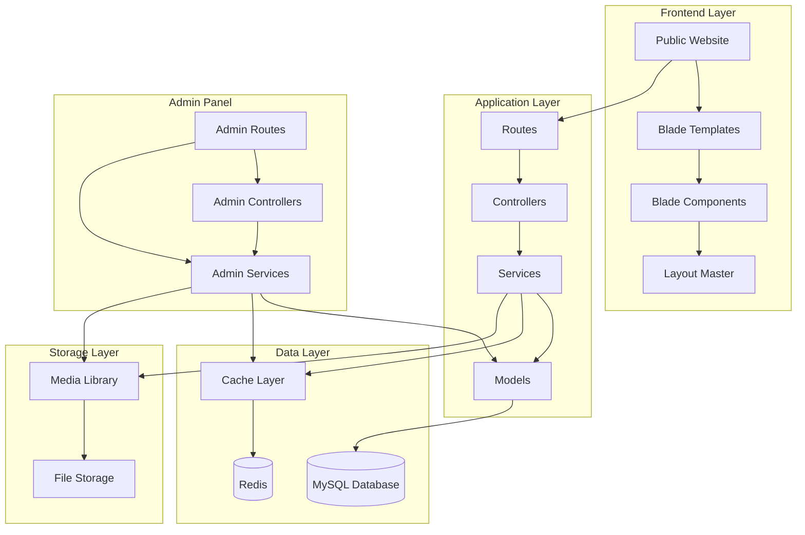
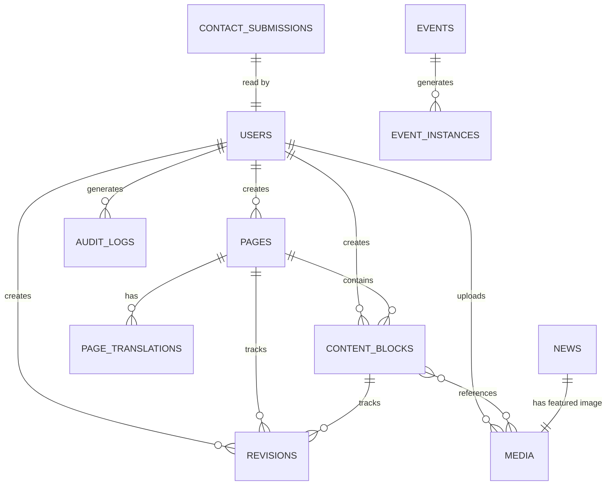

# Design Document: University CMS Upgrade

## Overview

This design document specifies the technical architecture for transforming a static 70+ page university website into a dynamic Laravel 13.x CMS application. The system will maintain the existing Bootstrap-based design (orange #D08301 and purple #1a096e color scheme) while providing comprehensive content management capabilities including versioning, multi-language support (English/Arabic), role-based access control, and a secure admin panel.

The architecture follows Laravel best practices with clear separation of concerns: Eloquent models for data access, service classes for business logic, Blade components for reusable UI elements, and a RESTful routing structure. The system will support 70+ existing pages organized into categories (Admissions, Faculties, Events, About, Quality, Media, Campus, Staff, Student_Services) with flexible content blocks (hero, text, card_grid, video, faq, testimonial, gallery, contact_form).

### Key Design Principles

- Modular Blade component architecture for DRY code
- Service layer pattern for business logic separation
- Eloquent ORM exclusively (no raw SQL)
- Environment-aware configuration (dev/test/prod)
- Cache-first performance strategy
- Comprehensive audit logging
- Multi-language content support (en/ar)

## Architecture

### High-Level System Architecture



### Application Flow

1. **Public Request Flow**:
   - User requests page by slug → Route → PageController
   - PageController → PageService → Page Model (with eager-loaded ContentBlocks)
   - Cache check → Return cached or render fresh
   - Blade template renders with appropriate components
   - Response returned with 200ms target

2. **Admin Request Flow**:
   - Admin accesses /admin → Authentication middleware
   - CRUD operations → AdminController → Service Layer
   - Service creates Revision and AuditLog entries
   - Cache invalidation for affected pages
   - Response with success/error feedback

3. **Media Upload Flow**:
   - File upload → Validation (type, size)
   - Unique filename generation → Storage
   - Media metadata saved to database
   - Media browser updated

### Technology Stack

- **Framework**: Laravel 13.x (PHP 8.3+)
- **Database**: MySQL 8.0+
- **Cache**: Redis (production), File (development)
- **Frontend**: Bootstrap 5, jQuery, WOW.js, Owl Carousel
- **WYSIWYG Editor**: TinyMCE or CKEditor
- **Testing**: PHPUnit 12.5+ with property-based testing extensions
- **Asset Compilation**: Vite
- **Queue**: Redis (production), Sync (development)

## Components and Interfaces

### Directory Structure

```
app/
├── Http/
│   ├── Controllers/
│   │   ├── PageController.php
│   │   ├── Admin/
│   │   │   ├── PageController.php
│   │   │   ├── ContentBlockController.php
│   │   │   ├── MediaController.php
│   │   │   ├── UserController.php
│   │   │   ├── EventController.php
│   │   │   ├── NewsController.php
│   │   │   ├── ContactController.php
│   │   │   ├── AuditLogController.php
│   │   │   └── RevisionController.php
│   │   └── SearchController.php
│   ├── Middleware/
│   │   ├── RoleMiddleware.php
│   │   └── FacultyAdminMiddleware.php
│   └── Requests/
│       ├── PageRequest.php
│       ├── ContentBlockRequest.php
│       └── MediaUploadRequest.php
├── Models/
│   ├── Page.php
│   ├── ContentBlock.php
│   ├── Revision.php
│   ├── Media.php
│   ├── Event.php
│   ├── News.php
│   ├── ContactSubmission.php
│   ├── AuditLog.php
│   └── User.php
├── Services/
│   ├── PageService.php
│   ├── ContentBlockService.php
│   ├── RevisionService.php
│   ├── MediaService.php
│   ├── EventService.php
│   ├── NewsService.php
│   ├── SearchService.php
│   ├── CacheService.php
│   └── MigrationService.php
└── View/
    └── Components/
        ├── Navbar.php
        ├── Footer.php
        ├── Hero.php
        ├── CardGrid.php
        ├── VideoSection.php
        ├── FaqSection.php
        ├── TestimonialCarousel.php
        └── GalleryGrid.php

resources/
├── views/
│   ├── layouts/
│   │   └── app.blade.php
│   ├── components/
│   │   ├── navbar.blade.php
│   │   ├── footer.blade.php
│   │   ├── hero.blade.php
│   │   ├── card-grid.blade.php
│   │   ├── video-section.blade.php
│   │   ├── faq-section.blade.php
│   │   ├── testimonial-carousel.blade.php
│   │   └── gallery-grid.blade.php
│   ├── pages/
│   │   ├── show.blade.php
│   │   └── 404.blade.php
│   ├── admin/
│   │   ├── dashboard.blade.php
│   │   ├── pages/
│   │   ├── content-blocks/
│   │   ├── media/
│   │   ├── events/
│   │   ├── news/
│   │   ├── users/
│   │   ├── audit-logs/
│   │   └── revisions/
│   └── search/
│       └── results.blade.php
```

### Core Service Interfaces

#### PageService

```php
interface PageServiceInterface
{
    public function getPublishedPageBySlug(string $slug, string $language): ?Page;
    public function createPage(array $data, User $user): Page;
    public function updatePage(Page $page, array $data, User $user): Page;
    public function publishPage(Page $page, User $user): Page;
    public function unpublishPage(Page $page, User $user): Page;
    public function archivePage(Page $page, User $user): Page;
    public function getPagesByCategory(string $category, string $language): Collection;
    public function generateUniqueSlug(string $title, ?int $excludeId = null): string;
}
```

#### ContentBlockService

```php
interface ContentBlockServiceInterface
{
    public function createBlock(array $data, User $user): ContentBlock;
    public function updateBlock(ContentBlock $block, array $data, User $user): ContentBlock;
    public function deleteBlock(ContentBlock $block, User $user): bool;
    public function reorderBlocks(Page $page, array $order): void;
    public function validateBlockContent(string $type, array $content): bool;
    public function getBlocksByPage(Page $page): Collection;
}
```

#### RevisionService

```php
interface RevisionServiceInterface
{
    public function createRevision(Model $model, array $oldValues, array $newValues, User $user): Revision;
    public function getRevisionHistory(Model $model): Collection;
    public function restoreRevision(Revision $revision, User $user): Model;
    public function compareRevisions(Revision $revision1, Revision $revision2): array;
}
```

#### MediaService

```php
interface MediaServiceInterface
{
    public function uploadFile(UploadedFile $file, User $user): Media;
    public function deleteFile(Media $media, User $user): bool;
    public function isFileReferenced(Media $media): bool;
    public function searchMedia(string $query, array $filters): Collection;
    public function generateUniqueFilename(string $originalName): string;
}
```

### Blade Component Interfaces

#### Navbar Component

```php
class Navbar extends Component
{
    public string $currentPage;
    public string $language;
    public array $menuItems;
    
    public function __construct(string $currentPage, string $language = 'en')
    {
        $this->currentPage = $currentPage;
        $this->language = $language;
        $this->menuItems = $this->buildMenuStructure();
    }
    
    public function render(): View
    {
        return view('components.navbar');
    }
}
```

#### Hero Component

```php
class Hero extends Component
{
    public string $title;
    public string $description;
    public string $image;
    public ?string $ctaText;
    public ?string $ctaLink;
    
    public function render(): View
    {
        return view('components.hero');
    }
}
```

#### CardGrid Component

```php
class CardGrid extends Component
{
    public array $cards;
    public int $columns;
    
    public function __construct(array $cards, int $columns = 3)
    {
        $this->cards = $cards;
        $this->columns = $columns;
    }
    
    public function render(): View
    {
        return view('components.card-grid');
    }
}
```

## Data Models

### Database Schema Design

#### Entity Relationship Diagram



### Database Tables

#### users

```sql
CREATE TABLE users (
    id BIGINT UNSIGNED AUTO_INCREMENT PRIMARY KEY,
    name VARCHAR(255) NOT NULL,
    email VARCHAR(255) UNIQUE NOT NULL,
    email_verified_at TIMESTAMP NULL,
    password VARCHAR(255) NOT NULL,
    role ENUM('super_admin', 'content_editor', 'faculty_admin') NOT NULL DEFAULT 'content_editor',
    faculty_category VARCHAR(50) NULL COMMENT 'For faculty_admin role',
    failed_login_attempts INT DEFAULT 0,
    locked_until TIMESTAMP NULL,
    remember_token VARCHAR(100) NULL,
    created_at TIMESTAMP DEFAULT CURRENT_TIMESTAMP,
    updated_at TIMESTAMP DEFAULT CURRENT_TIMESTAMP ON UPDATE CURRENT_TIMESTAMP,
    INDEX idx_email (email),
    INDEX idx_role (role)
) ENGINE=InnoDB DEFAULT CHARSET=utf8mb4 COLLATE=utf8mb4_unicode_ci;
```

#### pages

```sql
CREATE TABLE pages (
    id BIGINT UNSIGNED AUTO_INCREMENT PRIMARY KEY,
    title VARCHAR(255) NOT NULL,
    slug VARCHAR(255) NOT NULL,
    category ENUM('admissions', 'faculties', 'events', 'about', 'quality', 'media', 'campus', 'staff', 'student_services') NOT NULL,
    status ENUM('draft', 'published', 'archived') NOT NULL DEFAULT 'draft',
    language CHAR(2) NOT NULL DEFAULT 'en' COMMENT 'ISO 639-1 code',
    meta_title VARCHAR(255) NULL,
    meta_description TEXT NULL,
    meta_keywords VARCHAR(255) NULL,
    og_image VARCHAR(255) NULL,
    created_by BIGINT UNSIGNED NOT NULL,
    updated_by BIGINT UNSIGNED NULL,
    published_at TIMESTAMP NULL,
    created_at TIMESTAMP DEFAULT CURRENT_TIMESTAMP,
    updated_at TIMESTAMP DEFAULT CURRENT_TIMESTAMP ON UPDATE CURRENT_TIMESTAMP,
    UNIQUE KEY unique_slug_language (slug, language),
    INDEX idx_status (status),
    INDEX idx_category (category),
    INDEX idx_language (language),
    INDEX idx_published_at (published_at),
    FOREIGN KEY (created_by) REFERENCES users(id) ON DELETE RESTRICT,
    FOREIGN KEY (updated_by) REFERENCES users(id) ON DELETE SET NULL
) ENGINE=InnoDB DEFAULT CHARSET=utf8mb4 COLLATE=utf8mb4_unicode_ci;
```

#### content_blocks

```sql
CREATE TABLE content_blocks (
    id BIGINT UNSIGNED AUTO_INCREMENT PRIMARY KEY,
    page_id BIGINT UNSIGNED NOT NULL,
    type ENUM('hero', 'text', 'card_grid', 'video', 'faq', 'testimonial', 'gallery', 'contact_form') NOT NULL,
    content JSON NOT NULL COMMENT 'Type-specific content structure',
    display_order INT NOT NULL DEFAULT 0,
    is_reusable BOOLEAN DEFAULT FALSE,
    created_by BIGINT UNSIGNED NOT NULL,
    updated_by BIGINT UNSIGNED NULL,
    created_at TIMESTAMP DEFAULT CURRENT_TIMESTAMP,
    updated_at TIMESTAMP DEFAULT CURRENT_TIMESTAMP ON UPDATE CURRENT_TIMESTAMP,
    INDEX idx_page_order (page_id, display_order),
    INDEX idx_type (type),
    FOREIGN KEY (page_id) REFERENCES pages(id) ON DELETE CASCADE,
    FOREIGN KEY (created_by) REFERENCES users(id) ON DELETE RESTRICT,
    FOREIGN KEY (updated_by) REFERENCES users(id) ON DELETE SET NULL
) ENGINE=InnoDB DEFAULT CHARSET=utf8mb4 COLLATE=utf8mb4_unicode_ci;
```

#### revisions

```sql
CREATE TABLE revisions (
    id BIGINT UNSIGNED AUTO_INCREMENT PRIMARY KEY,
    user_id BIGINT UNSIGNED NOT NULL,
    revisionable_type VARCHAR(255) NOT NULL COMMENT 'Polymorphic type',
    revisionable_id BIGINT UNSIGNED NOT NULL COMMENT 'Polymorphic ID',
    action ENUM('created', 'updated', 'deleted', 'published', 'unpublished', 'restored') NOT NULL,
    old_values JSON NULL,
    new_values JSON NULL,
    created_at TIMESTAMP DEFAULT CURRENT_TIMESTAMP,
    INDEX idx_revisionable (revisionable_type, revisionable_id),
    INDEX idx_user (user_id),
    INDEX idx_created_at (created_at),
    FOREIGN KEY (user_id) REFERENCES users(id) ON DELETE RESTRICT
) ENGINE=InnoDB DEFAULT CHARSET=utf8mb4 COLLATE=utf8mb4_unicode_ci;
```

#### media

```sql
CREATE TABLE media (
    id BIGINT UNSIGNED AUTO_INCREMENT PRIMARY KEY,
    filename VARCHAR(255) NOT NULL UNIQUE,
    original_name VARCHAR(255) NOT NULL,
    mime_type VARCHAR(100) NOT NULL,
    size BIGINT UNSIGNED NOT NULL COMMENT 'Size in bytes',
    path VARCHAR(500) NOT NULL,
    uploaded_by BIGINT UNSIGNED NOT NULL,
    alt_text VARCHAR(255) NULL,
    created_at TIMESTAMP DEFAULT CURRENT_TIMESTAMP,
    updated_at TIMESTAMP DEFAULT CURRENT_TIMESTAMP ON UPDATE CURRENT_TIMESTAMP,
    INDEX idx_mime_type (mime_type),
    INDEX idx_uploaded_by (uploaded_by),
    FULLTEXT idx_search (original_name, alt_text),
    FOREIGN KEY (uploaded_by) REFERENCES users(id) ON DELETE RESTRICT
) ENGINE=InnoDB DEFAULT CHARSET=utf8mb4 COLLATE=utf8mb4_unicode_ci;
```

#### events

```sql
CREATE TABLE events (
    id BIGINT UNSIGNED AUTO_INCREMENT PRIMARY KEY,
    title VARCHAR(255) NOT NULL,
    description TEXT NOT NULL,
    start_date DATETIME NOT NULL,
    end_date DATETIME NOT NULL,
    location VARCHAR(255) NULL,
    category ENUM('competition', 'conference', 'exhibition', 'workshop', 'seminar') NOT NULL,
    image_id BIGINT UNSIGNED NULL,
    is_recurring BOOLEAN DEFAULT FALSE,
    recurrence_rule VARCHAR(255) NULL COMMENT 'iCalendar RRULE format',
    language CHAR(2) NOT NULL DEFAULT 'en',
    status ENUM('draft', 'published', 'archived') NOT NULL DEFAULT 'draft',
    created_by BIGINT UNSIGNED NOT NULL,
    created_at TIMESTAMP DEFAULT CURRENT_TIMESTAMP,
    updated_at TIMESTAMP DEFAULT CURRENT_TIMESTAMP ON UPDATE CURRENT_TIMESTAMP,
    INDEX idx_dates (start_date, end_date),
    INDEX idx_category (category),
    INDEX idx_status (status),
    FOREIGN KEY (image_id) REFERENCES media(id) ON DELETE SET NULL,
    FOREIGN KEY (created_by) REFERENCES users(id) ON DELETE RESTRICT
) ENGINE=InnoDB DEFAULT CHARSET=utf8mb4 COLLATE=utf8mb4_unicode_ci;
```

#### news

```sql
CREATE TABLE news (
    id BIGINT UNSIGNED AUTO_INCREMENT PRIMARY KEY,
    title VARCHAR(255) NOT NULL,
    slug VARCHAR(255) NOT NULL UNIQUE,
    excerpt TEXT NOT NULL,
    body LONGTEXT NOT NULL,
    featured_image_id BIGINT UNSIGNED NULL,
    author_id BIGINT UNSIGNED NOT NULL,
    category ENUM('announcement', 'achievement', 'research', 'partnership') NOT NULL,
    is_featured BOOLEAN DEFAULT FALSE,
    language CHAR(2) NOT NULL DEFAULT 'en',
    status ENUM('draft', 'published', 'archived') NOT NULL DEFAULT 'draft',
    published_at TIMESTAMP NULL,
    created_at TIMESTAMP DEFAULT CURRENT_TIMESTAMP,
    updated_at TIMESTAMP DEFAULT CURRENT_TIMESTAMP ON UPDATE CURRENT_TIMESTAMP,
    INDEX idx_slug (slug),
    INDEX idx_category (category),
    INDEX idx_status (status),
    INDEX idx_published_at (published_at),
    INDEX idx_featured (is_featured),
    FULLTEXT idx_search (title, excerpt, body),
    FOREIGN KEY (featured_image_id) REFERENCES media(id) ON DELETE SET NULL,
    FOREIGN KEY (author_id) REFERENCES users(id) ON DELETE RESTRICT
) ENGINE=InnoDB DEFAULT CHARSET=utf8mb4 COLLATE=utf8mb4_unicode_ci;
```

#### contact_submissions

```sql
CREATE TABLE contact_submissions (
    id BIGINT UNSIGNED AUTO_INCREMENT PRIMARY KEY,
    name VARCHAR(255) NOT NULL,
    email VARCHAR(255) NOT NULL,
    phone VARCHAR(50) NULL,
    subject VARCHAR(255) NOT NULL,
    message TEXT NOT NULL,
    ip_address VARCHAR(45) NOT NULL,
    user_agent TEXT NULL,
    is_read BOOLEAN DEFAULT FALSE,
    read_by BIGINT UNSIGNED NULL,
    read_at TIMESTAMP NULL,
    created_at TIMESTAMP DEFAULT CURRENT_TIMESTAMP,
    INDEX idx_is_read (is_read),
    INDEX idx_created_at (created_at),
    FOREIGN KEY (read_by) REFERENCES users(id) ON DELETE SET NULL
) ENGINE=InnoDB DEFAULT CHARSET=utf8mb4 COLLATE=utf8mb4_unicode_ci;
```

#### audit_logs

```sql
CREATE TABLE audit_logs (
    id BIGINT UNSIGNED AUTO_INCREMENT PRIMARY KEY,
    user_id BIGINT UNSIGNED NOT NULL,
    action ENUM('created', 'updated', 'deleted', 'published', 'unpublished', 'restored', 'login', 'logout') NOT NULL,
    model_type VARCHAR(255) NOT NULL,
    model_id BIGINT UNSIGNED NULL,
    old_values JSON NULL,
    new_values JSON NULL,
    ip_address VARCHAR(45) NOT NULL,
    user_agent TEXT NULL,
    created_at TIMESTAMP DEFAULT CURRENT_TIMESTAMP,
    INDEX idx_user (user_id),
    INDEX idx_model (model_type, model_id),
    INDEX idx_action (action),
    INDEX idx_created_at (created_at),
    FOREIGN KEY (user_id) REFERENCES users(id) ON DELETE RESTRICT
) ENGINE=InnoDB DEFAULT CHARSET=utf8mb4 COLLATE=utf8mb4_unicode_ci;
```

#### search_logs

```sql
CREATE TABLE search_logs (
    id BIGINT UNSIGNED AUTO_INCREMENT PRIMARY KEY,
    query VARCHAR(500) NOT NULL,
    results_count INT NOT NULL,
    filters JSON NULL,
    ip_address VARCHAR(45) NOT NULL,
    created_at TIMESTAMP DEFAULT CURRENT_TIMESTAMP,
    INDEX idx_query (query(255)),
    INDEX idx_created_at (created_at)
) ENGINE=InnoDB DEFAULT CHARSET=utf8mb4 COLLATE=utf8mb4_unicode_ci;
```

### Content Block JSON Schemas

#### Hero Block

```json
{
  "type": "object",
  "required": ["title", "description", "image"],
  "properties": {
    "title": {"type": "string", "maxLength": 255},
    "description": {"type": "string", "maxLength": 1000},
    "image": {"type": "string", "format": "uri"},
    "ctaText": {"type": "string", "maxLength": 50},
    "ctaLink": {"type": "string", "format": "uri"}
  }
}
```

#### Card Grid Block

```json
{
  "type": "object",
  "required": ["cards", "columns"],
  "properties": {
    "columns": {"type": "integer", "minimum": 1, "maximum": 4},
    "cards": {
      "type": "array",
      "items": {
        "type": "object",
        "required": ["title"],
        "properties": {
          "title": {"type": "string", "maxLength": 255},
          "description": {"type": "string", "maxLength": 500},
          "image": {"type": "string", "format": "uri"},
          "link": {"type": "string", "format": "uri"},
          "icon": {"type": "string"}
        }
      }
    }
  }
}
```

#### FAQ Block

```json
{
  "type": "object",
  "required": ["items"],
  "properties": {
    "items": {
      "type": "array",
      "items": {
        "type": "object",
        "required": ["question", "answer"],
        "properties": {
          "question": {"type": "string", "maxLength": 500},
          "answer": {"type": "string", "maxLength": 2000}
        }
      }
    }
  }
}
```

### Eloquent Model Relationships

#### Page Model

```php
class Page extends Model
{
    protected $fillable = ['title', 'slug', 'category', 'status', 'language', 'meta_title', 'meta_description', 'meta_keywords', 'og_image', 'published_at'];
    
    protected $casts = [
        'published_at' => 'datetime',
    ];
    
    public function contentBlocks(): HasMany
    {
        return $this->hasMany(ContentBlock::class)->orderBy('display_order');
    }
    
    public function creator(): BelongsTo
    {
        return $this->belongsTo(User::class, 'created_by');
    }
    
    public function updater(): BelongsTo
    {
        return $this->belongsTo(User::class, 'updated_by');
    }
    
    public function revisions(): MorphMany
    {
        return $this->morphMany(Revision::class, 'revisionable');
    }
    
    public function scopePublished($query)
    {
        return $query->where('status', 'published');
    }
    
    public function scopeByLanguage($query, string $language)
    {
        return $query->where('language', $language);
    }
    
    public function scopeByCategory($query, string $category)
    {
        return $query->where('category', $category);
    }
}
```

#### ContentBlock Model

```php
class ContentBlock extends Model
{
    protected $fillable = ['page_id', 'type', 'content', 'display_order', 'is_reusable'];
    
    protected $casts = [
        'content' => 'array',
        'is_reusable' => 'boolean',
    ];
    
    public function page(): BelongsTo
    {
        return $this->belongsTo(Page::class);
    }
    
    public function creator(): BelongsTo
    {
        return $this->belongsTo(User::class, 'created_by');
    }
    
    public function revisions(): MorphMany
    {
        return $this->morphMany(Revision::class, 'revisionable');
    }
}
```

## Correctness Properties

*A property is a characteristic or behavior that should hold true across all valid executions of a system—essentially, a formal statement about what the system should do. Properties serve as the bridge between human-readable specifications and machine-verifiable correctness guarantees.*

Before defining correctness properties, I need to analyze which acceptance criteria are suitable for property-based testing.


### Property Reflection

After analyzing all acceptance criteria, I've identified the following properties suitable for property-based testing. I'll now perform reflection to eliminate redundancy:

**Identified Properties:**
1. Slug generation from title (1.3)
2. Slug uniqueness with numeric suffixes (1.4)
3. Content blocks ordered by display_order (1.7, 2.3) - REDUNDANT: Same property
4. Page serialization round-trip (1.9)
5. Content block JSON validation (2.4)
6. Reusable block update propagation (2.7)
7. Content block serialization round-trip (2.9)
8. Revision creation on page changes (3.1)
9. Revision tracking of field changes (3.3, 3.4) - CAN COMBINE
10. Revision restoration (3.7)
11. Revision creation on restore (3.8)
12. Slug+language uniqueness (4.3)
13. Super_Admin permissions (5.4)
14. Content_Editor permissions (5.5)
15. Faculty_Admin scoped permissions (5.6)
16. Admin route authentication (5.9)
17. CSRF protection on forms (6.4)
18. File upload validation (7.3)
19. Unique filename generation (7.6)
20. Media ownership deletion (7.9)
21. Media reference integrity (7.10)
22. Audit log creation (8.1)
23. Audit log ordering (8.6)
24. Draft pages excluded from navigation (9.6)
25. Unpublished pages return 404 (9.9)
26. HTML sanitization (10.4)
27. HTML formatting preservation (10.6)
28. Blade component HTML validity (11.9)
29. Component selection by block type (12.2)
30. Active nav link highlighting (12.7)
31. Search matches query terms (16.2)
32. Search results ordered by relevance (16.5)
33. Search filtering (16.6)
34. Search limited to published content (16.8)
35. Search query logging (16.9)
36. Cache invalidation on update (18.2)
37. Image compression (18.5)

**After Reflection - Redundancies Identified:**
- Properties 3 (1.7) and 3 (2.3) are identical - KEEP ONE
- Properties 9 (3.3) and 9 (3.4) can be combined into single revision tracking property
- Properties 24 (9.6) and 25 (9.9) both test published-only filtering - CAN COMBINE
- Properties 16 (5.9) and 17 (6.4) both test authentication/security - KEEP SEPARATE (different concerns)
- Properties 31 (16.2) and 33 (16.6) and 34 (16.8) all test search filtering - CAN COMBINE

**Final Property Set (after removing redundancies):**

### Property 1: Slug Generation Validity
*For any* page title string, the generated slug SHALL be URL-safe (lowercase alphanumeric with hyphens) and derived from the title content.

**Validates: Requirements 1.3**

### Property 2: Slug Uniqueness with Suffixes
*For any* set of pages with the same base slug and language, all final slugs SHALL be unique with numeric suffixes appended as needed.

**Validates: Requirements 1.4**

### Property 3: Content Block Display Ordering
*For any* page with multiple content blocks, retrieving the blocks SHALL return them ordered by display_order in ascending sequence.

**Validates: Requirements 1.7, 2.3**

### Property 4: Page Serialization Round-Trip
*For any* valid Page object, serializing to array then deserializing SHALL produce an equivalent Page object with identical field values.

**Validates: Requirements 1.9**

### Property 5: Content Block JSON Schema Validation
*For any* content block type and JSON content, validation SHALL correctly accept content matching the type's schema and reject content that doesn't match.

**Validates: Requirements 2.4**

### Property 6: Reusable Block Update Propagation
*For any* reusable content block used on multiple pages, updating the block SHALL reflect the changes on all pages that reference it.

**Validates: Requirements 2.7**

### Property 7: Content Block Serialization Round-Trip
*For any* valid ContentBlock object, serializing to array then deserializing SHALL produce an equivalent ContentBlock object with identical content.

**Validates: Requirements 2.9**

### Property 8: Revision Creation on Changes
*For any* page or content block creation or update operation, a Revision record SHALL be created capturing the change.

**Validates: Requirements 3.1**

### Property 9: Revision Change Tracking
*For any* field change on a page or content block, the revision SHALL store both the old value and new value for that field.

**Validates: Requirements 3.3, 3.4**

### Property 10: Revision Restoration Correctness
*For any* revision of a page or content block, restoring that revision SHALL set the entity's fields to match the revision's old_values.

**Validates: Requirements 3.7**

### Property 11: Revision Creation on Restore
*For any* revision restoration operation, a new Revision record SHALL be created documenting the restoration action.

**Validates: Requirements 3.8**

### Property 12: Slug-Language Uniqueness
*For any* set of pages, the combination of slug and language SHALL be unique, allowing same slug across different languages.

**Validates: Requirements 4.3**

### Property 13: Super Admin Permission Completeness
*For any* content management action (create, update, delete, publish, restore), a Super_Admin user SHALL have permission to perform it.

**Validates: Requirements 5.4**

### Property 14: Content Editor Permission Restrictions
*For any* Content_Editor user, they SHALL be able to create and edit content and upload media, but SHALL NOT be able to publish content.

**Validates: Requirements 5.5**

### Property 15: Faculty Admin Scope Enforcement
*For any* Faculty_Admin user and page, the user SHALL only be able to access pages in their assigned faculty category.

**Validates: Requirements 5.6**

### Property 16: Admin Route Authentication Requirement
*For any* admin panel route, an unauthenticated request SHALL be rejected with 401 or redirected to login.

**Validates: Requirements 5.9**

### Property 17: CSRF Protection on Admin Forms
*For any* admin panel form submission without a valid CSRF token, the request SHALL be rejected.

**Validates: Requirements 6.4**

### Property 18: File Upload Validation
*For any* file upload attempt, validation SHALL correctly accept files matching allowed types and sizes (≤10MB) and reject others.

**Validates: Requirements 7.3**

### Property 19: Unique Filename Generation
*For any* set of file uploads including files with duplicate original names, all generated filenames SHALL be unique.

**Validates: Requirements 7.6**

### Property 20: Media Ownership Deletion Rights
*For any* media file, a Content_Editor SHALL be able to delete it if and only if they are the uploader.

**Validates: Requirements 7.9**

### Property 21: Media Reference Integrity
*For any* media file referenced in published content, deletion attempts SHALL fail to maintain referential integrity.

**Validates: Requirements 7.10**

### Property 22: Audit Log Creation on Actions
*For any* content creation, update, or deletion action, an AuditLog entry SHALL be created with user, action, model details, and timestamp.

**Validates: Requirements 8.1**

### Property 23: Audit Log Chronological Ordering
*For any* set of audit log entries, retrieving them SHALL return them ordered by created_at in descending (most recent first) order.

**Validates: Requirements 8.6**

### Property 24: Published Content Filtering
*For any* public-facing query (navigation, search, page access), only pages with status='published' SHALL be included in results.

**Validates: Requirements 9.6, 9.9, 16.8**

### Property 25: HTML Sanitization Security
*For any* HTML content input containing potential XSS vectors (script tags, event handlers, javascript: URLs), sanitization SHALL remove or neutralize the dangerous elements.

**Validates: Requirements 10.4**

### Property 26: HTML Formatting Preservation
*For any* formatted HTML content, saving to database then retrieving SHALL preserve the formatting structure and content.

**Validates: Requirements 10.6**

### Property 27: Blade Component HTML Validity
*For any* Blade component rendered with valid props, the output HTML SHALL be well-formed and valid according to HTML5 standards.

**Validates: Requirements 11.9**

### Property 28: Component Type Selection
*For any* content block with a specific type, rendering SHALL use the corresponding Blade component (hero→Hero, card_grid→CardGrid, etc.).

**Validates: Requirements 12.2**

### Property 29: Active Navigation Link Highlighting
*For any* page request, the navigation component SHALL mark the corresponding menu link as active based on the current page slug.

**Validates: Requirements 12.7**

### Property 30: Search Query Matching and Filtering
*For any* search query with optional filters (category, language, content type), results SHALL match the query terms AND satisfy all applied filters AND include only published content.

**Validates: Requirements 16.2, 16.6, 16.8**

### Property 31: Search Results Relevance Ordering
*For any* search results set, results SHALL be ordered by relevance score in descending order (most relevant first).

**Validates: Requirements 16.5**

### Property 32: Search Query Logging
*For any* search query submitted, a search_logs entry SHALL be created recording the query, result count, and timestamp.

**Validates: Requirements 16.9**

### Property 33: Cache Invalidation on Content Update
*For any* page or content block update, the cached version of affected pages SHALL be cleared from the cache.

**Validates: Requirements 18.2**

### Property 34: Image Compression on Upload
*For any* image file uploaded to the media library, a compressed version SHALL be created with file size smaller than the original.

**Validates: Requirements 18.5**

## Error Handling

### Error Handling Strategy

The CMS will implement comprehensive error handling across all layers:

1. **Validation Errors**: Form requests validate input and return field-specific error messages
2. **Authentication Errors**: Middleware catches unauthorized access and redirects/returns 401
3. **Authorization Errors**: Policy checks return 403 with descriptive messages
4. **Database Errors**: Wrapped in try-catch, logged, and return user-friendly messages
5. **File Upload Errors**: Validate before processing, return specific error for type/size violations
6. **Cache Errors**: Graceful degradation - if cache fails, fetch from database
7. **External Service Errors**: Email/notification failures logged but don't block operations

### Error Response Format

**API/AJAX Responses:**
```json
{
  "success": false,
  "message": "Human-readable error message",
  "errors": {
    "field_name": ["Specific validation error"]
  },
  "code": "ERROR_CODE"
}
```

**Web Responses:**
- Validation errors: Flash to session, redirect back with input
- 404 errors: Custom 404 page with university branding
- 403 errors: Custom forbidden page with explanation
- 500 errors: Generic error page in production, detailed in development

### Specific Error Scenarios

#### Slug Conflict Resolution
```php
// When duplicate slug detected
if ($this->slugExists($slug, $language, $excludeId)) {
    $counter = 1;
    while ($this->slugExists("{$slug}-{$counter}", $language, $excludeId)) {
        $counter++;
    }
    $slug = "{$slug}-{$counter}";
}
```

#### Media Reference Check
```php
// Before deleting media
if ($this->isMediaReferenced($media->id)) {
    throw new MediaInUseException(
        "Cannot delete media file: it is referenced in published content"
    );
}
```

#### Permission Denial
```php
// Faculty admin accessing wrong faculty
if ($user->role === 'faculty_admin' && $page->category !== $user->faculty_category) {
    abort(403, 'You do not have permission to access this faculty content');
}
```

#### Account Lockout
```php
// After failed login
$user->increment('failed_login_attempts');
if ($user->failed_login_attempts >= 5) {
    $user->update(['locked_until' => now()->addMinutes(15)]);
    throw new AccountLockedException('Account locked for 15 minutes due to failed login attempts');
}
```

## Testing Strategy

### Testing Approach

The CMS will use a comprehensive testing strategy combining multiple testing methodologies:

1. **Property-Based Tests**: Verify universal properties across randomized inputs (100+ iterations per property)
2. **Unit Tests**: Test specific examples, edge cases, and error conditions
3. **Integration Tests**: Test component interactions, database operations, and external services
4. **Feature Tests**: Test complete user workflows through HTTP requests

### Property-Based Testing Implementation

**Library**: We'll use a PHP property-based testing library compatible with PHPUnit. Options include:
- **Eris** (https://github.com/giorgiosironi/eris) - Mature PHP PBT library
- **php-quickcheck** (https://github.com/steos/php-quickcheck) - QuickCheck port for PHP

**Configuration**:
- Minimum 100 iterations per property test
- Each test tagged with comment referencing design property
- Tag format: `// Feature: university-cms-upgrade, Property {number}: {property_text}`

**Example Property Test Structure**:

```php
use Eris\Generator;
use Eris\TestTrait;

class PageServicePropertyTest extends TestCase
{
    use TestTrait;
    
    /**
     * Feature: university-cms-upgrade, Property 1: Slug Generation Validity
     * For any page title string, the generated slug SHALL be URL-safe and derived from title
     */
    public function test_slug_generation_produces_url_safe_slugs()
    {
        $this->forAll(
            Generator\string()
        )->then(function ($title) {
            $slug = $this->pageService->generateSlug($title);
            
            // Slug should be lowercase
            $this->assertEquals(strtolower($slug), $slug);
            
            // Slug should only contain alphanumeric and hyphens
            $this->assertMatchesRegularExpression('/^[a-z0-9-]+$/', $slug);
            
            // Slug should be derived from title (contain some title characters)
            if (strlen($title) > 0) {
                $this->assertNotEmpty($slug);
            }
        });
    }
    
    /**
     * Feature: university-cms-upgrade, Property 4: Page Serialization Round-Trip
     * For any valid Page object, serializing then deserializing SHALL produce equivalent object
     */
    public function test_page_serialization_round_trip()
    {
        $this->forAll(
            $this->pageGenerator()
        )->then(function ($page) {
            $array = $page->toArray();
            $deserialized = Page::fromArray($array);
            
            $this->assertEquals($page->title, $deserialized->title);
            $this->assertEquals($page->slug, $deserialized->slug);
            $this->assertEquals($page->category, $deserialized->category);
            $this->assertEquals($page->status, $deserialized->status);
            $this->assertEquals($page->language, $deserialized->language);
        });
    }
    
    private function pageGenerator()
    {
        return Generator\associative([
            'title' => Generator\string(),
            'category' => Generator\elements(['admissions', 'faculties', 'events', 'about']),
            'status' => Generator\elements(['draft', 'published', 'archived']),
            'language' => Generator\elements(['en', 'ar']),
        ])->map(function ($data) {
            return Page::factory()->make($data);
        });
    }
}
```

### Unit Testing Strategy

Unit tests will focus on:
- Specific examples demonstrating correct behavior
- Edge cases (empty strings, null values, boundary conditions)
- Error conditions (invalid input, permission denials)
- Business logic in service classes

**Example Unit Tests**:
```php
class PageServiceTest extends TestCase
{
    public function test_creating_page_without_language_fails()
    {
        $this->expectException(ValidationException::class);
        $this->pageService->createPage(['title' => 'Test'], $this->user);
    }
    
    public function test_content_editor_cannot_publish_page()
    {
        $editor = User::factory()->contentEditor()->create();
        $page = Page::factory()->draft()->create();
        
        $this->expectException(AuthorizationException::class);
        $this->pageService->publishPage($page, $editor);
    }
    
    public function test_faculty_admin_cannot_access_other_faculty_pages()
    {
        $admin = User::factory()->facultyAdmin(['faculty_category' => 'faculties'])->create();
        $page = Page::factory()->create(['category' => 'admissions']);
        
        $this->assertFalse($admin->can('update', $page));
    }
}
```

### Integration Testing

Integration tests will verify:
- Database operations and transactions
- Cache interactions
- File storage operations
- Email sending
- External service integrations

### Test Coverage Goals

- **Overall Coverage**: Minimum 80%
- **Service Layer**: Minimum 90% (core business logic)
- **Models**: Minimum 85%
- **Controllers**: Minimum 75%
- **Property Tests**: All 34 properties implemented

### Testing Commands

```bash
# Run all tests
php artisan test

# Run only property-based tests
php artisan test --group=property

# Run with coverage
php artisan test --coverage

# Run specific test suite
php artisan test tests/Unit/Services/PageServiceTest.php
```

## Security Design

### Authentication & Authorization

**Authentication**:
- Laravel Sanctum for session-based auth
- Bcrypt password hashing (Laravel default)
- Account lockout after 5 failed attempts (15 minute lockout)
- Password reset via email with signed URLs

**Authorization**:
- Laravel Policies for model-level permissions
- Middleware for route-level protection
- Role-based access control (RBAC)

**Role Permissions Matrix**:

| Action | Super Admin | Content Editor | Faculty Admin |
|--------|-------------|----------------|---------------|
| Create Content | ✓ | ✓ | ✓ (own faculty) |
| Edit Content | ✓ | ✓ | ✓ (own faculty) |
| Delete Content | ✓ | ✗ | ✗ |
| Publish Content | ✓ | ✗ | ✗ |
| Manage Users | ✓ | ✗ | ✗ |
| View Audit Logs | ✓ | ✗ | ✗ |
| Restore Revisions | ✓ | ✗ | ✗ |
| Upload Media | ✓ | ✓ | ✓ |
| Delete Own Media | ✓ | ✓ | ✓ |
| Delete Others' Media | ✓ | ✗ | ✗ |

### Input Validation & Sanitization

**Validation**:
- Form Request classes for all input validation
- Server-side validation (never trust client)
- Type validation for JSON content blocks
- File upload validation (type, size, mime)

**Sanitization**:
- HTML Purifier for WYSIWYG content
- Strip dangerous tags: `<script>`, `<iframe>`, `<object>`, `<embed>`
- Remove event handlers: `onclick`, `onerror`, etc.
- Sanitize `href` and `src` attributes (no `javascript:` URLs)

**Example Sanitization**:
```php
use HTMLPurifier;
use HTMLPurifier_Config;

class ContentSanitizer
{
    public function sanitize(string $html): string
    {
        $config = HTMLPurifier_Config::createDefault();
        $config->set('HTML.Allowed', 'p,b,i,u,strong,em,a[href],ul,ol,li,h1,h2,h3,h4,h5,h6,img[src|alt],br');
        $config->set('AutoFormat.RemoveEmpty', true);
        
        $purifier = new HTMLPurifier($config);
        return $purifier->purify($html);
    }
}
```

### CSRF Protection

- Laravel's built-in CSRF protection enabled
- CSRF token required on all POST/PUT/DELETE requests
- Token rotation on login
- SameSite cookie attribute set to 'lax'

### SQL Injection Prevention

- Eloquent ORM exclusively (no raw SQL)
- Parameterized queries for all database operations
- Input validation before database operations

### XSS Prevention

- Blade template auto-escaping enabled
- HTML Purifier for user-generated content
- Content Security Policy headers
- HTTPOnly and Secure flags on cookies

### File Upload Security

- Whitelist allowed file types
- Validate mime type (not just extension)
- Store files outside web root
- Generate unique filenames
- Scan for malware (optional: ClamAV integration)
- Size limits enforced (10MB max)

### Security Headers

```php
// Middleware to add security headers
return $next($request)->withHeaders([
    'X-Frame-Options' => 'SAMEORIGIN',
    'X-Content-Type-Options' => 'nosniff',
    'X-XSS-Protection' => '1; mode=block',
    'Referrer-Policy' => 'strict-origin-when-cross-origin',
    'Content-Security-Policy' => "default-src 'self'; script-src 'self' 'unsafe-inline'; style-src 'self' 'unsafe-inline';",
]);
```

### Audit Logging

- All content changes logged with user attribution
- IP address and user agent captured
- Immutable audit log (no deletions)
- 2-year retention minimum
- Super Admin access only

## Performance Considerations

### Caching Strategy

**Page Caching**:
- Full page cache for 1 hour (Redis in production)
- Cache key: `page:{slug}:{language}`
- Invalidate on content update
- Warm cache on publish

**Query Caching**:
- Cache expensive queries (navigation menu, footer data)
- Cache key includes language and relevant filters
- TTL: 1 hour

**Fragment Caching**:
- Cache individual content blocks for reusable blocks
- Cache key: `block:{id}`
- Invalidate on block update

**Cache Implementation**:
```php
class PageService
{
    public function getPublishedPageBySlug(string $slug, string $language): ?Page
    {
        return Cache::remember(
            "page:{$slug}:{$language}",
            3600, // 1 hour
            fn() => Page::with('contentBlocks.media')
                ->published()
                ->byLanguage($language)
                ->where('slug', $slug)
                ->first()
        );
    }
    
    public function updatePage(Page $page, array $data, User $user): Page
    {
        $page->update($data);
        
        // Invalidate cache
        Cache::forget("page:{$page->slug}:{$page->language}");
        
        return $page;
    }
}
```

### Database Optimization

**Indexing Strategy**:
- Composite index on `(slug, language)` for page lookups
- Index on `status` for filtering published pages
- Index on `category` for category pages
- Index on `published_at` for chronological queries
- Fulltext index on searchable fields (title, content)
- Index on foreign keys

**Query Optimization**:
- Eager load relationships to prevent N+1 queries
- Use `select()` to limit columns retrieved
- Paginate large result sets
- Use database transactions for multi-step operations

**Example Optimized Query**:
```php
// Eager load relationships
$page = Page::with([
    'contentBlocks' => function ($query) {
        $query->orderBy('display_order');
    },
    'contentBlocks.media',
    'creator:id,name',
])->findOrFail($id);

// Instead of:
// $page = Page::find($id);
// $blocks = $page->contentBlocks; // N+1 query
// foreach ($blocks as $block) {
//     $media = $block->media; // N+1 query
// }
```

### Asset Optimization

**Images**:
- Compress on upload (80% quality JPEG, optimized PNG)
- Generate WebP versions for modern browsers
- Lazy load images below the fold
- Responsive images with srcset
- CDN delivery (optional)

**CSS/JavaScript**:
- Minify in production (Vite handles this)
- Combine files to reduce HTTP requests
- Defer non-critical JavaScript
- Inline critical CSS
- Use browser caching headers

**Vite Configuration**:
```javascript
// vite.config.js
export default defineConfig({
    build: {
        minify: 'terser',
        cssMinify: true,
        rollupOptions: {
            output: {
                manualChunks: {
                    vendor: ['jquery', 'bootstrap'],
                    admin: ['tinymce'],
                }
            }
        }
    }
});
```

### Response Time Targets

- **Page Load**: < 200ms (server processing)
- **Admin Panel**: < 300ms (more complex queries)
- **Search**: < 500ms (fulltext search)
- **Media Upload**: < 2s (for 10MB file)
- **Cache Hit**: < 10ms

### Monitoring & Profiling

- Laravel Telescope for development debugging
- Query logging in development
- Slow query log (> 100ms)
- Cache hit/miss ratio monitoring
- Response time monitoring (Laravel Horizon for queues)

### Scalability Considerations

**Horizontal Scaling**:
- Stateless application (session in Redis)
- Shared file storage (S3 or NFS)
- Database read replicas for read-heavy operations
- Load balancer for multiple app servers

**Vertical Scaling**:
- Optimize PHP opcache settings
- Increase PHP memory limit for large imports
- Database connection pooling
- Redis memory allocation

### Queue System

**Async Operations**:
- Email sending (contact form, notifications)
- Image processing (compression, WebP generation)
- Search index updates
- Sitemap generation
- Large data imports

**Queue Configuration**:
```php
// config/queue.php
'connections' => [
    'redis' => [
        'driver' => 'redis',
        'connection' => 'default',
        'queue' => env('REDIS_QUEUE', 'default'),
        'retry_after' => 90,
        'block_for' => null,
    ],
],
```

---

## Implementation Notes

### Migration from Static Files

The system includes an Artisan command to migrate existing static HTML files:

```bash
php artisan cms:migrate-static-files
```

This command will:
1. Parse all HTML files in `old_files/` directory
2. Extract page metadata (title, category from filename patterns)
3. Identify content sections (hero, cards, FAQ, etc.) using DOM parsing
4. Create Page records with appropriate categories
5. Create ContentBlock records for each identified section
6. Copy media files to storage and create Media records
7. Generate slugs from filenames
8. Output migration summary report

### Development Workflow

1. **Local Development**:
   - Use SQLite or MySQL locally
   - File cache driver
   - Detailed error messages
   - Laravel Telescope enabled

2. **Testing Environment**:
   - Separate test database
   - Redis cache
   - Email logging (no real sends)
   - Seeded test data

3. **Production Environment**:
   - MySQL database
   - Redis cache and queues
   - Real email sending
   - Error logging only
   - HTTPS enforced
   - Debug mode disabled

### Environment Variables

```env
# Application
APP_ENV=production
APP_DEBUG=false
APP_URL=https://nctu.edu.eg

# Database
DB_CONNECTION=mysql
DB_HOST=127.0.0.1
DB_PORT=3306
DB_DATABASE=university_cms
DB_USERNAME=cms_user
DB_PASSWORD=secure_password

# Cache
CACHE_DRIVER=redis
REDIS_HOST=127.0.0.1
REDIS_PASSWORD=null
REDIS_PORT=6379

# Queue
QUEUE_CONNECTION=redis

# Mail
MAIL_MAILER=smtp
MAIL_HOST=smtp.mailtrap.io
MAIL_PORT=2525
MAIL_USERNAME=null
MAIL_PASSWORD=null
MAIL_FROM_ADDRESS=noreply@nctu.edu.eg
MAIL_FROM_NAME="${APP_NAME}"

# File Storage
FILESYSTEM_DISK=local
```

---

This design document provides a comprehensive technical specification for the University CMS Upgrade project. The architecture follows Laravel best practices with clear separation of concerns, comprehensive testing strategy including property-based testing for critical business logic, and robust security measures. The system is designed to be maintainable, scalable, and performant while preserving the existing university brand identity.
