# NCTU Portal - Database Entity Relationship Diagram (ERD)

## Overview
This document presents the complete Entity-Relationship Diagram for the NCTU University Portal database, showing all tables, their attributes, and relationships.

---

## Database Information
- **Database Name**: `graduation_project_clacet2`
- **DBMS**: MySQL 8.4.3
- **Engine**: InnoDB
- **Charset**: utf8mb4_unicode_ci
- **Total Tables**: 27+

---

## Mermaid ERD Diagram

```mermaid
erDiagram
    users ||--o{ admissions : "submits"
    users ||--o{ admissions : "reviews"
    users ||--o{ media : "uploads"
    users ||--o{ sessions : "has"
    departments ||--o{ faculty_members : "employs"
    pages ||--o{ page_sections : "contains"
    
    users {
        bigint id PK
        string name
        string email UK
        string password
        enum role
        timestamp email_verified_at
        string remember_token
        timestamp created_at
        timestamp updated_at
    }
    
    admissions {
        bigint id PK
        bigint user_id FK
        string national_id UK
        string first_name
        string second_name
        string third_name
        string fourth_name
        enum gender
        string birth_governorate
        string current_governorate
        string city_center
        string village_district
        text street_address
        string religion
        date birth_date
        string phone
        string email UK
        string student_photo
        string birth_certificate
        string qualification_certificate
        string student_id_document
        string parent_name
        string parent_phone
        string father_occupation
        string parent_id_document
        enum status
        int current_step
        string student_code UK
        text rejection_reason
        timestamp reviewed_at
        bigint reviewed_by FK
        timestamp created_at
        timestamp updated_at
    }
    
    departments {
        bigint id PK
        string name
        string slug UK
        text description
        string image
        string icon
        int order
        boolean is_active
        timestamp created_at
        timestamp updated_at
    }
    
    faculty_members {
        bigint id PK
        string name
        string position
        bigint department_id FK
        longtext bio
        string photo
        string email
        string phone
        int order
        boolean is_active
        timestamp created_at
        timestamp updated_at
    }
    
    events {
        bigint id PK
        string title
        string slug UK
        string category
        text description
        datetime event_date
        string location
        string image
        string link
        boolean is_featured
        boolean is_active
        timestamp created_at
        timestamp updated_at
    }
    
    news {
        bigint id PK
        string title
        string slug UK
        text excerpt
        longtext content
        string featured_image
        string category
        datetime published_at
        int views_count
        boolean is_featured
        boolean is_published
        timestamp created_at
        timestamp updated_at
    }
    
    galleries {
        bigint id PK
        string title
        text description
        string image
        string category
        int order
        boolean is_active
        timestamp created_at
        timestamp updated_at
    }
    
    activities {
        bigint id PK
        string title
        text description
        string image
        string category
        boolean is_active
        timestamp created_at
        timestamp updated_at
    }
    
    trainings {
        bigint id PK
        string title
        text description
        string organization
        string location
        datetime start_date
        datetime end_date
        string image
        string image1
        string image2
        string image3
        string image4
        string registration_link
        int capacity
        int registered_count
        boolean is_active
        timestamp created_at
        timestamp updated_at
    }
    
    competitions {
        bigint id PK
        string title
        text description
        string date
        string image
        boolean is_active
        int order
        timestamp created_at
        timestamp updated_at
    }
    
    graduates {
        bigint id PK
        string title
        text description
        string image
        boolean is_active
        int order
        timestamp created_at
        timestamp updated_at
    }
    
    deans {
        bigint id PK
        string full_name
        string title
        string position
        string faculty
        string image
        text welcome_text
        text education
        text experience
        int order
        timestamp created_at
        timestamp updated_at
    }
    
    president_contents {
        bigint id PK
        string full_name
        string title
        string image
        text welcome_text
        text education
        text experience
        timestamp created_at
        timestamp updated_at
    }
    
    external_protocols {
        bigint id PK
        string title
        text description
        string organization_name
        string image
        int year
        boolean is_active
        int order
        timestamp created_at
        timestamp updated_at
    }
    
    internal_protocols {
        bigint id PK
        string title
        text description
        string organization_name
        string image
        int year
        boolean is_active
        int order
        timestamp created_at
        timestamp updated_at
    }
    
    tuition_fees {
        bigint id PK
        string year_range
        decimal amount
        string currency
        text notes
        boolean is_active
        timestamp created_at
        timestamp updated_at
    }
    
    testimonials {
        bigint id PK
        string student_name
        string program
        int graduation_year
        text testimonial_text
        string photo
        int order
        boolean is_active
        timestamp created_at
        timestamp updated_at
    }
    
    contact_submissions {
        bigint id PK
        string name
        string email
        string subject
        longtext message
        string ip_address
        text user_agent
        boolean is_read
        timestamp created_at
        timestamp updated_at
    }
    
    pages {
        bigint id PK
        string slug UK
        string title
        longtext content
        string meta_description
        string meta_keywords
        boolean is_published
        timestamp created_at
        timestamp updated_at
    }
    
    page_sections {
        bigint id PK
        bigint page_id FK
        string section_title
        longtext section_content
        string section_type
        int order
        timestamp created_at
        timestamp updated_at
    }
    
    site_settings {
        bigint id PK
        string key UK
        text value
        string type
        timestamp created_at
        timestamp updated_at
    }
    
    media {
        bigint id PK
        string filename
        string original_filename
        string path
        string mime_type
        bigint size
        string alt_text
        bigint uploaded_by FK
        timestamp created_at
        timestamp updated_at
    }
    
    sessions {
        string id PK
        bigint user_id FK
        string ip_address
        text user_agent
        longtext payload
        int last_activity
    }
    
    cache {
        string key PK
        mediumtext value
        bigint expiration
    }
    
    cache_locks {
        string key PK
        string owner
        bigint expiration
    }
    
    password_reset_tokens {
        string email PK
        string token
        timestamp created_at
    }
    
    personal_access_tokens {
        bigint id PK
        string tokenable_type
        bigint tokenable_id
        string name
        string token UK
        text abilities
        timestamp last_used_at
        timestamp expires_at
        timestamp created_at
        timestamp updated_at
    }
    
    failed_jobs {
        bigint id PK
        string uuid UK
        text connection
        text queue
        longtext payload
        longtext exception
        timestamp failed_at
    }
    
    jobs {
        bigint id PK
        string queue
        longtext payload
        tinyint attempts
        int reserved_at
        int available_at
        int created_at
    }
    
    job_batches {
        string id PK
        string name
        int total_jobs
        int pending_jobs
        int failed_jobs
        longtext failed_job_ids
        mediumtext options
        int cancelled_at
        int created_at
        int finished_at
    }
    
    migrations {
        int id PK
        string migration
        int batch
    }
```

---

## Table Relationships Explained

### 1. **User-Centered Relationships**

#### users → admissions (One-to-Many)
- **Type**: One user can have one admission application
- **Foreign Key**: `admissions.user_id` → `users.id`
- **Relationship**: `User hasOne Admission`
- **Use Case**: Students create admission applications linked to their accounts

#### users → admissions (Reviewer)
- **Type**: One admin can review many admissions
- **Foreign Key**: `admissions.reviewed_by` → `users.id`
- **Relationship**: `User hasMany reviewed_admissions`
- **Use Case**: Admin users review and approve/reject applications

#### users → media (One-to-Many)
- **Foreign Key**: `media.uploaded_by` → `users.id`
- **Relationship**: `User hasMany Media`
- **Use Case**: Track which admin uploaded which files

#### users → sessions (One-to-Many)
- **Foreign Key**: `sessions.user_id` → `users.id`
- **Relationship**: `User hasMany Sessions`
- **Use Case**: Manage active user sessions across devices

---

### 2. **Department Relationships**

#### departments → faculty_members (One-to-Many)
- **Foreign Key**: `faculty_members.department_id` → `departments.id`
- **Relationship**: `Department hasMany FacultyMembers`
- **Use Case**: Associate faculty members with their respective departments
- **Delete Behavior**: SET NULL (if department deleted, faculty member remains but unassigned)

---

### 3. **Page Management Relationships**

#### pages → page_sections (One-to-Many)
- **Foreign Key**: `page_sections.page_id` → `pages.id`
- **Relationship**: `Page hasMany PageSections`
- **Use Case**: Dynamic pages with multiple content sections
- **Delete Behavior**: CASCADE (if page deleted, all sections deleted)

---

## Key Table Purposes

### Core Authentication & Authorization
- **users**: User accounts (students, admins)
- **password_reset_tokens**: Password recovery tokens
- **personal_access_tokens**: API authentication tokens
- **sessions**: Active user sessions

### Student Management
- **admissions**: Student admission applications with multi-step form data
- **testimonials**: Student testimonials and success stories

### Content Management (CMS)
- **news**: News articles with categories and featured images
- **events**: University events with dates and locations
- **galleries**: Photo gallery with categorization
- **activities**: Student activities and achievements
- **competitions**: Competition highlights and results
- **graduates**: Graduate achievements and success stories
- **trainings**: Training programs and workshops

### Academic Structure
- **departments**: Academic departments (Mechatronics, IT, Petroleum, etc.)
- **faculty_members**: Faculty staff linked to departments

### University Information
- **president_contents**: University president information
- **deans**: Faculty deans information
- **external_protocols**: International partnerships
- **internal_protocols**: Domestic collaborations
- **tuition_fees**: Fee structure by year

### System Features
- **contact_submissions**: Contact form submissions
- **pages**: Dynamic page content
- **page_sections**: Modular page sections
- **site_settings**: System-wide configuration (key-value pairs)
- **media**: Centralized media library

### System Infrastructure
- **cache**: Application cache storage
- **cache_locks**: Distributed locking mechanism
- **jobs**: Background job queue
- **job_batches**: Batch job processing
- **failed_jobs**: Failed background jobs log
- **migrations**: Database version control

---

## Field Types & Constraints Summary

### Primary Keys
- All tables use `bigint unsigned AUTO_INCREMENT` for `id`
- Sessions and cache use `string` primary keys
- Password reset tokens use `email` as primary key

### Unique Constraints
- `users.email` - Prevent duplicate accounts
- `admissions.national_id` - One application per citizen
- `admissions.email` - Unique contact per application
- `admissions.student_code` - Unique identifier after approval
- `departments.slug` - URL-friendly unique identifiers
- `events.slug` - SEO-friendly URLs
- `news.slug` - Article URL uniqueness
- `pages.slug` - Page routing uniqueness

### Foreign Key Constraints
- `admissions.user_id` → `users.id` (CASCADE on delete)
- `admissions.reviewed_by` → `users.id` (SET NULL on delete)
- `faculty_members.department_id` → `departments.id` (SET NULL on delete)
- `page_sections.page_id` → `pages.id` (CASCADE on delete)
- `media.uploaded_by` → `users.id` (SET NULL on delete)
- `sessions.user_id` → `users.id` (nullable)

### Enum Fields
- `users.role`: 'student', 'admin'
- `admissions.status`: 'draft', 'pending', 'accepted', 'rejected'
- `admissions.gender`: 'male', 'female'

### Boolean (tinyint) Fields
Used for activation/feature flags:
- `is_active` - Enable/disable records
- `is_featured` - Highlight important content
- `is_published` - Publication status
- `is_read` - Read/unread status

### Timestamp Fields
All tables include:
- `created_at` - Record creation timestamp
- `updated_at` - Last modification timestamp

Additional timestamps:
- `reviewed_at` - Admission review timestamp
- `published_at` - Content publication date
- `email_verified_at` - Email verification status

---

## Database Indexing Strategy

### Primary Indexes
- `id` column on all tables (clustered index)

### Unique Indexes
- Email addresses for uniqueness validation
- Slug fields for URL routing
- National ID for citizen identification
- Student codes for approved applications

### Foreign Key Indexes
- All foreign key columns automatically indexed
- Improves JOIN performance
- Speeds up relationship queries

### Performance Indexes
- `cache.expiration` - Cache cleanup queries
- `cache_locks.expiration` - Lock management
- `sessions.last_activity` - Session cleanup
- `sessions.user_id` - User session lookup
- `jobs.queue` - Job queue processing

---

## Data Integrity Features

### Referential Integrity
- Foreign key constraints enforce valid relationships
- CASCADE deletes prevent orphaned records
- SET NULL maintains data after parent deletion

### Validation at Database Level
- NOT NULL constraints on critical fields
- UNIQUE constraints prevent duplicates
- ENUM types restrict value ranges
- DEFAULT values ensure consistency

### Soft Delete Ready
- All tables have `created_at` and `updated_at`
- Boolean flags (`is_active`) allow soft deletes
- Audit trail preserved for compliance

---

## Storage & Performance

### Table Engine
- **InnoDB**: All tables use InnoDB engine
- Supports ACID transactions
- Foreign key constraints
- Row-level locking
- Crash recovery

### Character Set
- **utf8mb4**: Full Unicode support
- Collation: `utf8mb4_unicode_ci`
- Supports Arabic, Chinese, Emoji
- Case-insensitive comparisons

### File Storage Strategy
- Images and documents stored in filesystem
- Database stores file paths only
- Reduces database size
- Improves backup/restore speed

---

## Security Considerations

### Password Security
- Passwords hashed using bcrypt
- Never stored in plain text
- Salt automatically managed

### Sensitive Data
- National IDs encrypted at application level
- Document paths secured via Laravel storage
- Personal information access-controlled

### Audit Trail
- `created_at` / `updated_at` on all records
- `reviewed_by` tracks admin actions
- IP address logging for contact forms

---

## Scalability Features

### Caching Infrastructure
- `cache` table for application caching
- `cache_locks` for distributed systems
- Reduces database load
- Speeds up repeated queries

### Queue System
- `jobs` table for background processing
- `job_batches` for bulk operations
- `failed_jobs` for error handling
- Prevents blocking user requests

### Session Management
- Database-driven sessions
- Multiple device support
- Centralized session control
- Easy logout from all devices

---

*Document Version: 1.0*  
*Database: graduation_project_clacet2 (MySQL 8.4)*  
*Total Tables: 27*  
*Generated for Figma/FigJam Export*
