# NCTU University Portal - Complete Project Flowchart

## Overview
This flowchart demonstrates the complete user journey through the NCTU University Portal system, covering both student/guest interactions and administrative operations.

---

## Mermaid Flowchart

```mermaid
graph TD
    Start[User Visits Website] --> LangCheck{Select Language}
    LangCheck -->|English| EnLang[EN Route Prefix]
    LangCheck -->|Arabic| ArLang[AR Route Prefix]
    
    EnLang --> GuestHome[Guest/Student Homepage]
    ArLang --> GuestHome
    
    GuestHome --> Browse{User Action}
    
    %% Guest Browsing Flow
    Browse -->|View Content| PublicPages[Browse Public Pages]
    PublicPages --> AboutDropdown[About University]
    PublicPages --> Faculties[Faculties & Programs]
    PublicPages --> MediaCenter[News/Events/Gallery]
    PublicPages --> Admissions[Admission Requirements]
    PublicPages --> Campus[Campus & Activities]
    
    AboutDropdown --> DynamicContent[Dynamic Content Load]
    Faculties --> DynamicContent
    MediaCenter --> DynamicContent
    Admissions --> DynamicContent
    Campus --> DynamicContent
    
    DynamicContent --> Controller[PageController]
    Controller --> EloquentModel[Eloquent Models]
    EloquentModel --> MySQL[(MySQL Database)]
    MySQL --> Response[Blade View Render]
    Response --> Display[Display to User]
    
    %% AI Chatbot Flow
    Browse -->|Ask Chatbot| ChatOpen[Open AI Chatbot]
    ChatOpen --> ChatInput[User Types Question]
    ChatInput --> ChatFetch[JavaScript Fetch API]
    ChatFetch --> ChatRoute[POST /chatbot/message]
    ChatRoute --> ChatController[ChatbotController]
    ChatController --> GeminiAPI[Google Gemini 1.5 Flash]
    GeminiAPI --> ChatResponse[AI Generated Response]
    ChatResponse --> ChatDisplay[Display in Chat UI]
    
    %% Student Registration & Login Flow
    Browse -->|Register| RegisterPage[Registration Form]
    RegisterPage --> CreateAccount[Create User Account]
    CreateAccount --> UserTable[(users table)]
    UserTable --> LoginRedirect[Redirect to Login]
    
    Browse -->|Login| LoginCheck{Authentication}
    LoginCheck -->|Failed| LoginPage[Login Form]
    LoginPage --> RetryLogin[Retry Authentication]
    RetryLogin --> LoginCheck
    
    LoginCheck -->|Success| RoleCheck{User Role?}
    
    %% Student Flow
    RoleCheck -->|Student| StudentDashboard[Student Portal]
    StudentDashboard --> StudentActions{Student Options}
    
    StudentActions -->|Apply| AdmissionForm[Multi-Step Admission Form]
    AdmissionForm --> PersonalInfo[Step 1: Personal Information]
    PersonalInfo --> ContactInfo[Step 2: Contact Details]
    ContactInfo --> ParentInfo[Step 3: Parent Information]
    ParentInfo --> Documents[Step 4: Upload Documents]
    Documents --> ReviewSubmit[Review & Submit]
    ReviewSubmit --> AdmissionTable[(admissions table)]
    AdmissionTable --> StatusDraft[Status: Pending]
    StatusDraft --> EmailNotif[Send Confirmation Email]
    EmailNotif --> StudentWait[Wait for Admin Review]
    
    StudentActions -->|View Profile| ProfileView[View Application Status]
    StudentActions -->|Edit Profile| ProfileEdit[Update Personal Info]
    StudentActions -->|Change Password| PasswordChange[Update Credentials]
    
    ProfileView --> CheckStatus{Application Status}
    CheckStatus -->|Draft/Pending| WaitingMsg[Awaiting Review Message]
    CheckStatus -->|Accepted| AcceptedMsg[Congratulations + Student Code]
    CheckStatus -->|Rejected| RejectedMsg[Rejection Reason Displayed]
    
    %% Admin Flow
    RoleCheck -->|Admin| AdminAuth{Verify Admin Role}
    AdminAuth -->|Not Admin| AccessDenied[403 Access Denied]
    AdminAuth -->|Verified| AdminDashboard[Admin Dashboard]
    
    AdminDashboard --> AdminMenu{Admin Operations}
    
    %% Admissions Management
    AdminMenu -->|Manage Admissions| AdmissionsList[View Pending Applications]
    AdmissionsList --> ReviewApp[Review Application Details]
    ReviewApp --> AdminDecision{Decision}
    
    AdminDecision -->|Approve| GenerateCode[Auto-Generate Student Code]
    GenerateCode --> UpdateAdmission[Update Status: Accepted]
    UpdateAdmission --> SendAcceptEmail[Send Acceptance Email]
    SendAcceptEmail --> LogApproval[Log Reviewer & Timestamp]
    
    AdminDecision -->|Reject| RejectReason[Enter Rejection Reason]
    RejectReason --> UpdateRejection[Update Status: Rejected]
    UpdateRejection --> SendRejectEmail[Send Rejection Email]
    
    %% Content Management
    AdminMenu -->|Manage Content| ContentCRUD{Content Type}
    
    ContentCRUD -->|News| NewsManage[Create/Edit/Delete News]
    ContentCRUD -->|Events| EventsManage[Create/Edit/Delete Events]
    ContentCRUD -->|Gallery| GalleryManage[Upload/Delete Images]
    ContentCRUD -->|Activities| ActivitiesManage[Manage Student Activities]
    ContentCRUD -->|Competitions| CompetitionsManage[Manage Competitions]
    ContentCRUD -->|Protocols| ProtocolsManage[Internal/External Protocols]
    ContentCRUD -->|Graduates| GraduatesManage[Graduate Achievements]
    ContentCRUD -->|Trainings| TrainingsManage[Training Programs]
    ContentCRUD -->|Testimonials| TestimonialsManage[Student Testimonials]
    
    NewsManage --> UpdateDB[Update Database]
    EventsManage --> UpdateDB
    GalleryManage --> UpdateDB
    ActivitiesManage --> UpdateDB
    CompetitionsManage --> UpdateDB
    ProtocolsManage --> UpdateDB
    GraduatesManage --> UpdateDB
    TrainingsManage --> UpdateDB
    TestimonialsManage --> UpdateDB
    
    UpdateDB --> ClearCache[Clear Laravel Cache]
    ClearCache --> RefreshFrontend[Refresh Public Pages]
    RefreshFrontend --> AdminSuccess[Success Notification]
    
    %% Settings & Configuration
    AdminMenu -->|Edit Static Pages| PageEditor[President/Dean Content]
    PageEditor --> UpdatePresidentContent[(president_contents table)]
    UpdatePresidentContent --> UpdateDeans[(deans table)]
    
    AdminMenu -->|Tuition Fees| FeesManager[Manage Fee Structure]
    FeesManager --> UpdateFees[(tuition_fees table)]
    
    AdminMenu -->|Departments| DepartmentsEdit[Edit Department Info]
    DepartmentsEdit --> UpdateDepartments[(departments table)]
    
    %% Logout Flow
    StudentActions -->|Logout| LogoutAction[Destroy Session]
    AdminMenu -->|Logout| LogoutAction
    LogoutAction --> RedirectHome[Redirect to Homepage]
    RedirectHome --> GuestHome

    %% Styling
    style Start fill:#e3f2fd
    style GuestHome fill:#e8f5e9
    style AdminDashboard fill:#fff3e0
    style MySQL fill:#ffccbc
    style AdmissionTable fill:#ffccbc
    style UserTable fill:#ffccbc
    style GeminiAPI fill:#f3e5f5
    style AcceptedMsg fill:#c8e6c9
    style RejectedMsg fill:#ffcdd2
    style AccessDenied fill:#ffcdd2
    style AdminSuccess fill:#c8e6c9
```

---

## Key User Journeys

### 1. Guest/Student Public Browsing
1. User visits homepage (language selection: EN/AR)
2. Browse public pages (About, Faculties, Admissions, Media, Campus)
3. Dynamic content loaded from MySQL via Laravel controllers
4. Blade templates render with Tailwind CSS styling
5. Bilingual support with `mcamara/laravel-localization`

### 2. Student Registration & Admission Application
1. Guest registers new account → User created in `users` table
2. Student logs in → Authenticated session created
3. Access multi-step admission form:
   - Step 1: Personal Information (Name, National ID, DOB, Gender)
   - Step 2: Contact Details (Phone, Email, Address, Governorate)
   - Step 3: Parent Information (Guardian details, occupation)
   - Step 4: Document Upload (Photo, Birth Certificate, ID, Qualifications)
4. Submit application → Status set to "Pending"
5. Confirmation email sent to student
6. Wait for admin review

### 3. Admin Review & Decision
1. Admin logs in → Role verification middleware
2. Access admin dashboard
3. View pending applications list
4. Review application details & uploaded documents
5. Decision:
   - **Approve**: Auto-generate student code → Send acceptance email → Update status
   - **Reject**: Enter reason → Send rejection email → Update status
6. Log reviewer ID and timestamp

### 4. Content Management (Admin)
1. Admin selects content type (News, Events, Gallery, etc.)
2. CRUD operations via resource controllers
3. Image uploads handled via Laravel storage
4. Database updated with new/modified content
5. Cache cleared to reflect changes
6. Public pages automatically updated

### 5. AI Chatbot Assistance
1. User clicks floating chatbot button
2. Types question in chat input
3. JavaScript sends POST request to `/chatbot/message`
4. Laravel validates request (CSRF, max 1000 chars)
5. ChatbotController calls Google Gemini API
6. AI response streamed back as JSON
7. JavaScript displays response in chat UI

---

## System Architecture Highlights

### Frontend Layer
- **Blade Templates** with Tailwind CSS
- **JavaScript** (Vanilla + Fetch API)
- **Responsive Design** (Mobile-first)
- **RTL Support** for Arabic

### Backend Layer
- **Laravel 11** (PHP 8.2+)
- **MVC Pattern** (Models, Controllers, Views)
- **Middleware**: Auth, CSRF, Admin Role Check
- **Eloquent ORM** for database operations

### Database Layer
- **MySQL 8.4+**
- **27+ Tables** (Users, Admissions, Content, Media)
- **Foreign Keys** for relational integrity
- **Indexes** for performance optimization

### External Services
- **Google Gemini 1.5 Flash** (AI Chatbot)
- **Laravel Localization** (Bilingual support)
- **Mail Service** (Application notifications)

---

## Security Features

- ✅ CSRF Protection on all POST requests
- ✅ Role-based access control (Admin middleware)
- ✅ Input validation with Laravel Form Requests
- ✅ SQL injection prevention via Eloquent ORM
- ✅ XSS protection via Blade escaping
- ✅ File upload validation (type, size, mime)
- ✅ Password hashing with bcrypt
- ✅ Session management with database driver

---

## Performance Optimizations

- ✅ Database indexing on foreign keys
- ✅ Laravel query caching
- ✅ Eager loading to prevent N+1 queries
- ✅ Image optimization and lazy loading
- ✅ Vite for frontend asset bundling
- ✅ Route caching for production

---

*Document Version: 1.0*  
*System: NCTU University Portal*  
*Generated for Figma/FigJam Export*
